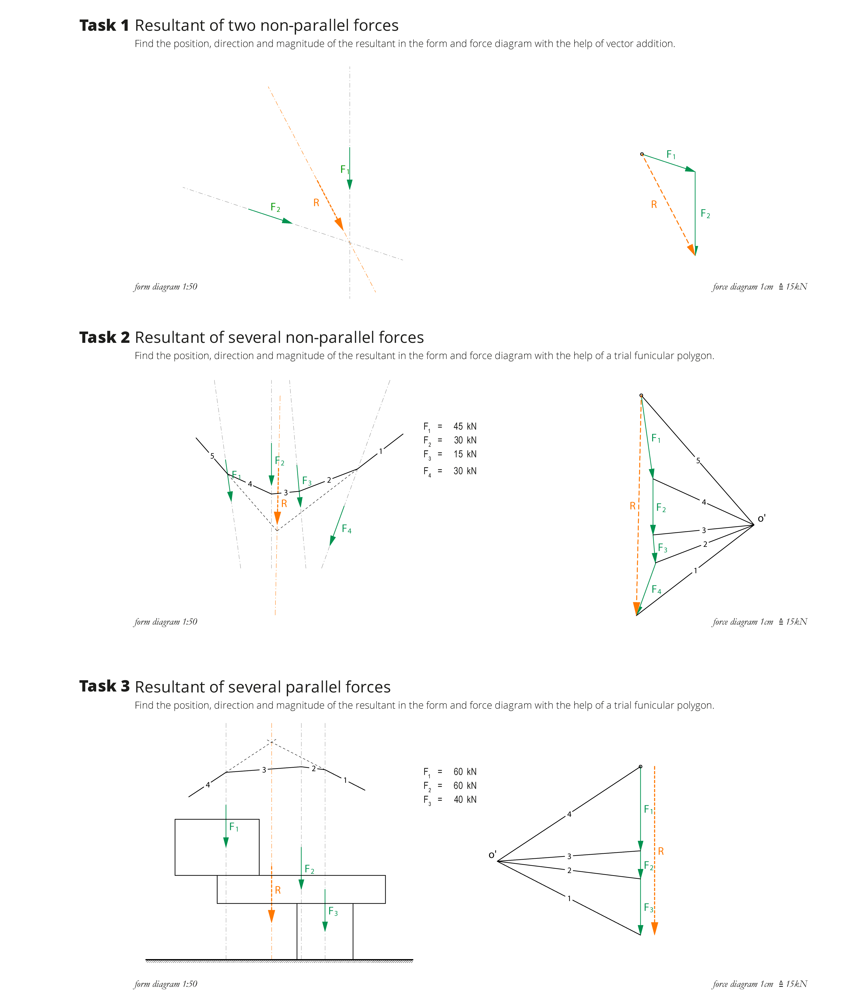

# Exercise


Complete the tasks below, and submit a zipped folder that includes the following three files **by 9:00am on Friday, September 30th**.

1. Part 1 - Rhino file with completed tasks
2. Part 2 - completed Grasshopper definition
3. Part 3 - Summarising PDF

Please follow the file naming convention as shown in the [**Syllabus**](../../syllabus.md#submissions).

#### [Submit here](https://polybox.ethz.ch/index.php/s/sYq8E48z8HC6ot5)


## Part 1 - Graphic statics in Rhino

Complete the following 4 tasks using the Rhino file you will find [**here**](./#files).

### Task 0 - Review eQUILIBRIUM drawings

eQUILIBRIUM, an interactive environment for graphic statics-based structural design, provides examples of pre-constructed graphic statics drawings. These drawings are interactive and have various features that can be used to learn various fundamental principles of graphic statics.

For the first task of this exercise, simply check out the [first two rows of the "drawings" page on the eQUILIBRIUM platform](https://block.arch.ethz.ch/eq/drawing), and learn the principles and construction techniques demonstrated in each drawing.

.png>)

### Task 1 - Resultant of two non-parallel forces

For the given loading case, find the magnitude and direction (indicate using the `ArrowHead` command in Rhino) of the resultant in the force diagram as well as its position in the form diagram. In the PDF, briefly describe the construction procedure.

.png>)

### Task 2 - Resultant of several non-parallel forces

Find the magnitude and direction (indicate using the `ArrowHead` command in Rhino) of the resultant in the force diagram as well as its position in the form diagram by using a trial funicular. In the PDF, briefly describe the construction procedure.

.png>)

### Task 3 - Resultant of several parallel forces

Given is a shape of stacked boxes glued together. Each acting force corresponds to the weight of one box. Find the magnitude and the direction of the resultant (indicate direction using the `ArrowHead` command in Rhino) in the force diagram as well as its position in the form diagram by using a trial funicular and check whether the arrangement is stable. In the PDF, briefly describe the construction procedure and the solution.

<figure><figcaption></figcaption></figure>

### Task 4 - Drawing subsystems

Draw a corresponding force diagram for each subsystem (a-f). Determine the magnitude \[kN] of each force and mark its direction (using the `ArrowHead` command in Rhino) in the subsystem. Indicate tension forces with red and compression forces with blue. In the PDF, briefly describe the construction procedure and the solution for each subsystem.

.png>)

## Part 2 - Grasshopper basics

.png>)

### Task Description

To practise your Grasshopper skills and parametric thinking, write your name initials in a parametric manner!

* Use only a single starting point, vectors and lines.
* Build it up in a way that you can change the height, width and distance between letters, and scale it all, move it all, and rotate it all.
* Pipe the letters to make them look balloony and colour them in a colour pattern of your choice (to practise datastructure handling).


These components should be part of your script (possibly amongst others):

* [ ] Slider
* [ ] Panel
* [ ] Construct Point
* [ ] Unit Vectors and/or Vector XYZ
* [ ] Multiplication
* [ ] Division
* [ ] Rotate Vector
* [ ] Move
* [ ] Line and/or Interpolate Curve
* [ ] Merge
* [ ] Entwine
* [ ] ... find a component yourself for the balloony look
* [ ] Weave
* [ ] Colour Swatch
* [ ] Custom Preview

All these components were introduced to you in the tutorial step-by-step so it's a good opportunity to revise the tutorial.


### Example

This is how it looks like for the initials of CSDI: (for you 2 letters are enough)

**1.** This is how your letters should look with auxiliary points of construction and the lines/curves connecting them:

**2.** This is how they should look like as balloons with a colour pattern:


Task: What is the boolean input pattern in numbers of 0 and 1.


**3.** This is how you should be able to change the height, width and distance of the letters:

**4.** This is how you should be able to change the overall position of it:

**5.** This is how you should be able to change the overall scale of it:

**6.** This is how you should be able to rotate the letters:

.gif>)

## Part 3 - Summarising PDF

Answer the questions in the following document.



## Solutions

### Part 1 - Graphic statics in Rhino

<figure><figcaption></figcaption></figure>

<figure><figcaption></figcaption></figure>

### Part 2 - Grasshopper basics

In the following zip you will find two possible solutions for this exercise. There are surely many more possible solutions so it is ok if you solved the problem in a different way.&#x20;



&#x20;
