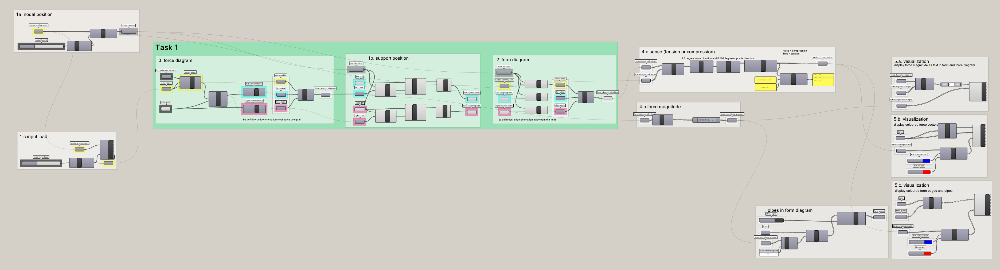
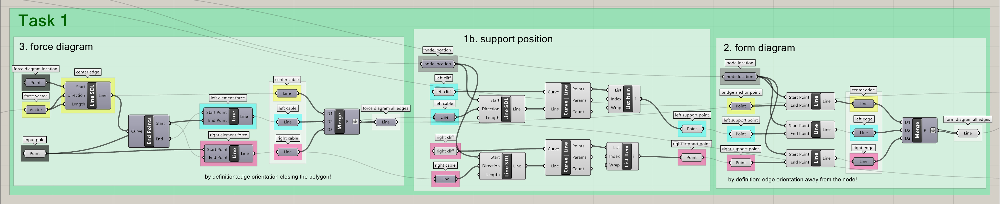
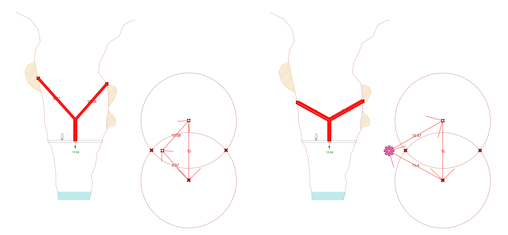
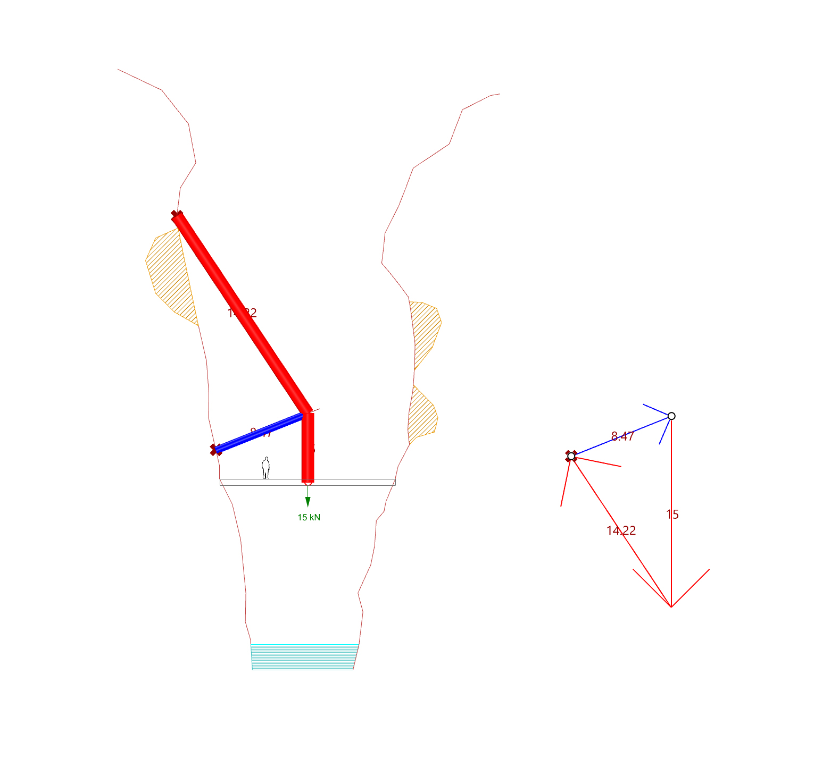
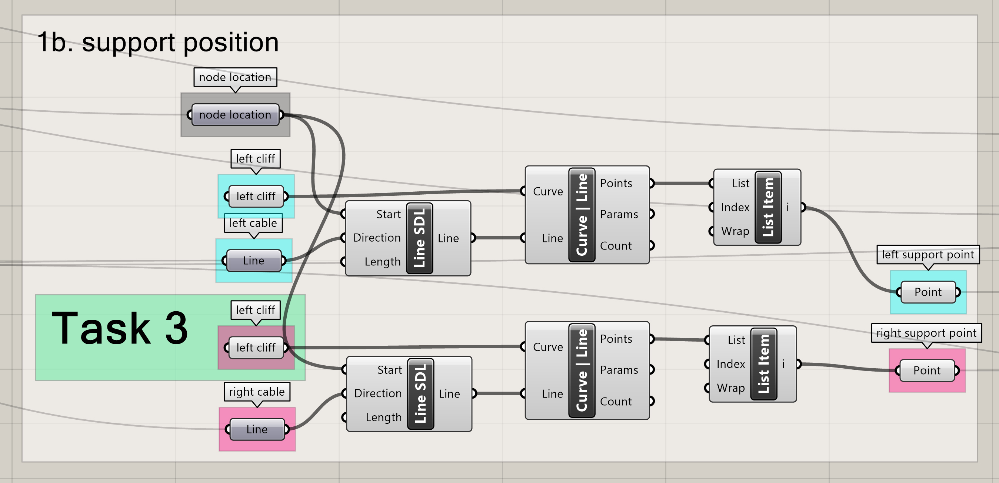
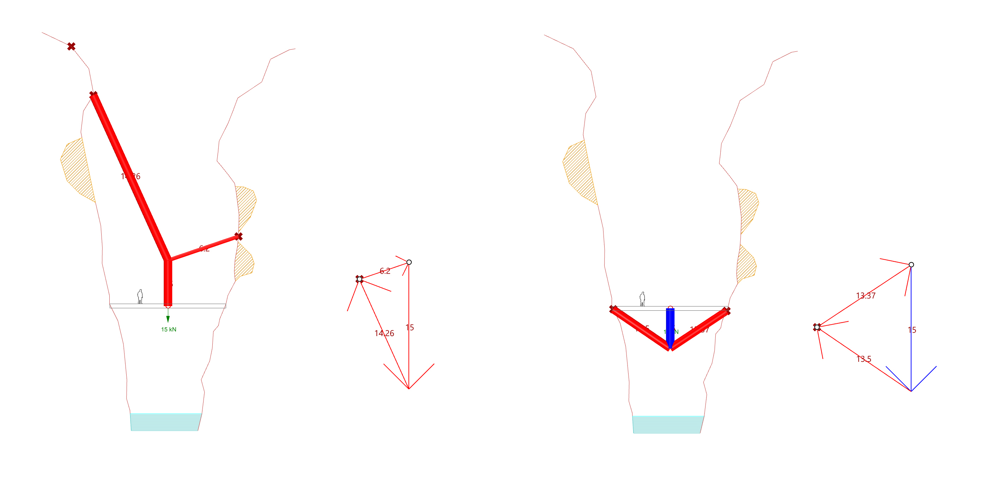

# Solution

## Task 1

Task 1 asks you to re-assemble the single-node bridge parametric model from the tutorial to allow for the interactive control of the force diagram. To do this, we will reverse the process shown in the tutorial. Instead of going from form diagram to force diagram, we will go from force diagram to form diagram. To assemble this model, we will first define the nodal position and the input load. Then, we will build the force diagram. Next, we will find the position of the supports. After, we will create the form diagram. Finally, we will have the parts dealing with the sense, force magnitude and visualization, which we can directly take from algorithm shown in the tutorial.

<figure><figcaption></figcaption></figure>

<figure><figcaption></figcaption></figure>

## Task 2

In Task 2, you need to constrain the force diagram so that the forces at the supports do not exceed 12 kN. To do this, we will create two circles at the extremes of the loadline with a radius equivalent to 12 kN. This defines the region for which both support forces are equal or below 12 kN. We will then use the components "Point in Curves", "Equality" and "Dispatch" to help us build a conditional statement that allows us to display a warning symbol if the pole is not within the mentioned region.

<figure><figcaption></figcaption></figure>

<figure><figcaption></figcaption></figure>

## Task 3

In Task 3 you are asked to find a way to generate single-sided bridges and that way can be as short as inputting twice the curve of the left cliff.&#x20;

<figure><figcaption></figcaption></figure>

<figure><figcaption></figcaption></figure>

## Task 4

Task 4 asks you to display a warning symbol if the geometry of the bridge (form diagram) happens to use as supports areas of the cliff which are unstable. As you did for Task 2, here the solution can be constructed by building a conditional using the "Point in Curves", "Equality" and "Dispatch".

<figure><figcaption></figcaption></figure>

## Task 5

Task 5 asks you to explore the design space of your model and choose two solutions that you find interesting from the architectural and structural points of view. &#x20;

<figure><figcaption></figcaption></figure>
