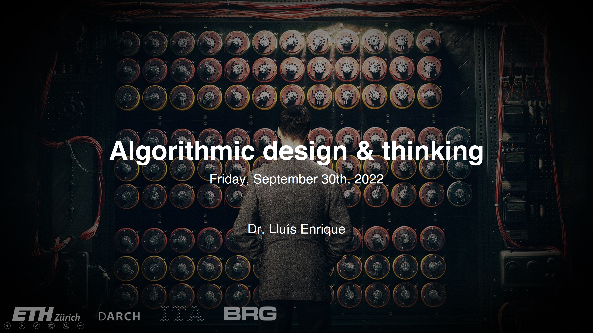

# Lecture

<figure><figcaption></figcaption></figure>

In this lecture, the following topics are presented:

* History of computation in architecture and computer-aided design
* Basic elements and concepts of algorithmic design


