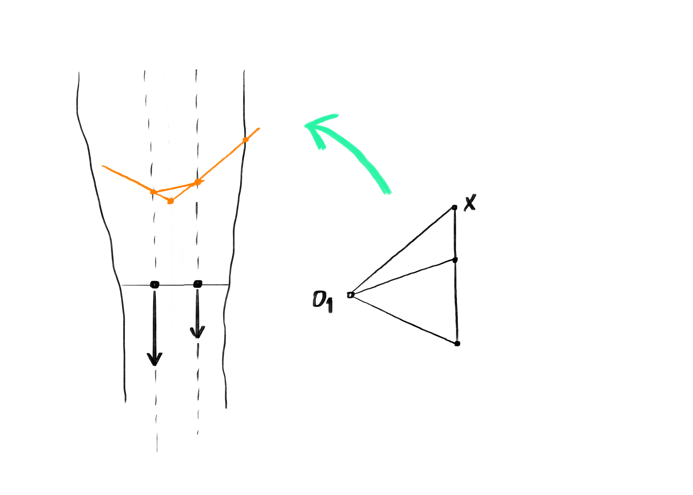

# Tutorial 2

## Learning Goals

In this tutorial, you will:

* learn how the Grasshopper algorithm from module 2 is translated to Python.
* understand the advantages that programming in Python has over creating an algorithm in Grasshopper.

## Translating to Python module 2 algorithm

In the previous module we built a linear algorithm in Grasshopper for the form-finding of a two-dimensional funicular cable structure. To do this the steps we followed the same as when we build the funicular with paper and pencil: 1. Resultant, 2. Reactions and 3. Internal forces. We will now program using Python (within Grasshopper) the same algorithm following those same steps. This will allow you to learn the basics of linear programming and identify its main advantages over Grasshopper.


You will find the Rhinoceros and Grasshopper files for this tutorial [**here**](./#files).&#x20;


### 1.a Input loads

<figure><figcaption></figcaption></figure>


Input**:**

* **p1** and **p2** (anchor points)
* **n1** and **n2** (magnitudes)

Output:

* **Lp\_anc** (List of points/anchors)
* **Ln\_mag** (List of numbers/magnitudes)
* **Lv\_load** (List of vectors/loads)
* **Ll\_LOA** (List of lines/lines of action)


In this step we will store all the necessary data regarding the input loads:

* First, we will first store in two lists the anchor points and magnitudes (Lp\_anc and Ln\_mag).
* After, we we will create a vector (v) and a line of action (LOA) for each of the loads and we will store these in lists (Lv\_load and Ll\_LOA).

```python
#1.a INPUT LOADS

#input
Lp_anc=[p1,p2]
Ln_mag=[n1,n2]

#vector loads
Lv_load=[]
for i in range (0,len(Lp_anc)):
    v=[0,Ln_mag[i],0]
    Lv_load.append(v)

#LOA (Line Of Action)
Ll_LOA=[]
for i in range (0,len(Lp_anc)):
    p=rs.CopyObject(Lp_anc[i])
    rs.MoveObject(p,[0,-10,0])
    LOA=rs.AddLine(Lp_anc[i],p)
    Ll_LOA.append(LOA)
```

### 1.b Resultant (force diagram)

<figure><figcaption></figcaption></figure>


Input:

* **Lv\_load** (List of vectors/loads)
* **X** (first point load line in force diagram)
* **O1** (random pole to find resultant)

Output:

* **Lp\_loadline** (List of points/loadline)
* **Ll\_loadline** (List of lines/loadline)
* **Lal\_force** (List of auxiliary lines/force diagram)


We now want to find out the position of the resultant in the form diagram using the trial funicular. To do this, we will build the force diagram. These are the steps:

* First, we will create the load line of the force diagram using as a starting point one point from Rhinoceros (X) and we will already store this first point in a list (Lp\_loadline).
* Then, we will make a copy a X (p), move it according to the first vector in Lv\_load and create a line representing the external force (X to p). As we want to do the same for all the external loads we will need a loop.


In order to add the loads one after another we must update the value of the starting point (X) with that of the moved point in the previous iteration (p), so at the end of the loop we must write X=p. We will store the points along the load line (Lp\_loadline) as well as the lines representing the external loads (Ll\_loadline).


* After, we will define, also in Rhinoceros, the random pole O1 and we will create using a loop the auxiliary lines connecting O1 with the points along the load line. We will store these lines in Lal\_force.

```python
#1.b RESULTANT (FORCE DIAGRAM)

#force diagram load line
Lp_loadline=[]
Lp_loadline.append(X)
Ll_loadline=[]
for i in range (0,len(Lv_load)):
    p=rs.CopyObject(X,Lv_load[i])
    l=rs.AddLine(X,p)
    Lp_loadline.append(p)
    Ll_loadline.append(l)
    X=p

#force diagram aux lines
Lal_force=[]
for i in range (0,len(Lp_loadline)):
    al=rs.AddLine(O1,Lp_loadline[i])
    Lal_force.append(al)
```

### 1.c Resultant (force diagram)

<figure><figcaption></figcaption></figure>


Input:

* **p\_right** (point/right cliff)
* **O1** (random pole to find resultant
* **Ll\_LOA** (List of lines/lines of action)
* **Lal\_force** (List of auxiliary lines/force diagram)

Output:

* **p\_R** (point/resultant)


We will continue the construction of the resultant in the form diagram. These are the steps:

* First, we will define a point a long the curve of the right cliff (p\_right). We will do this in Grasshopper as the component "Point On Curve" makes it very easy.
* Then, we will copy the auxiliary lines of the force diagram, move them to the form diagram and intersect them with the lines of action of the external loads. In order to repeat these actions we will create a loop.


&#x20;If you construct the resultant by hand, as shown in the tutorial of module 2, you will see that when a structure has two external loads with two lines of action, there are three auxiliary lines in the force diagram. We now want to create a loop that **moves** and **intersects**, but we have three auxiliary lines and only two lines of action. With which line do we intersect the last auxiliary line? Let's go around this problem by simply adding again the last line of action in Ll\_LOA. We don't really need that last intersection point, but in this way we can use the loop for all three auxiliary lines.



Notice that in the loop vector v is not always the same. The first vector v goes from O1 to p\_right. However, in the next iterations of the loop, v goes from O1 to the intersection points we find. Therefore we must update the value of p\_right at the end of the loop.


* Finally, we will intersect the first and last auxiliary line in the form diagram to find the point p\_R across which the vertical line of action of the resultant goes through.

```python
#1.c RESULTANT (FORM DIAGRAM)

Ll_LOA.append(Ll_LOA[-1])

Lal_form=[]
for i in range (0,len(Lal_force)):
    v=rs.VectorCreate(p_right,O1)
    al=rs.CopyObject(Lal_force[i],v)
    ip=rs.LineLineIntersection(al,Ll_LOA[i])
    Lal_form.append(al)
    p_right=ip[0]

p_R=rs.LineLineIntersection(Lal_form[0],Lal_form[-1])[0]
```

### 2. Supports and reactions

<figure><figcaption></figcaption></figure>


Input:

* **sp\_left** (support point/left cliff)
* **sp\_right** (support point/right cliff)
* **p\_R** (point/resultant)
* **Lp\_loadline** (List of points/loadline)

Output:

* **O2** (point to create the global equilibrium polygon)


In this section we will calculate the reaction forces at the supports. These are the steps:

* First, we will define the position of the supports (sp\_left and sp\_right) along the curves of the cliffs using once again the Grasshopper component "Point On Curve".
* Then, we will create two lines in the form diagram connecting the supports with the anchor of the resultant (p\_R).
* Finally, we will move these lines from the form diagram to the force diagram and intersect them finding point O2 and closing the polygon of forces representing the global equilibrium of the structure.

```python
#2. SUPPORTS AND REACTIONS

#creating lines of reaction forces in form diagram
l1=rs.AddLine(p_R,sp_left)
l2=rs.AddLine(p_R,sp_right)

#building reaction forces in form diagram
v1=rs.VectorCreate(Lp_loadline[-1],p_R)
l1_m=rs.MoveObject(l1,v1)

v2=rs.VectorCreate(Lp_loadline[0],p_R)
l2_m=rs.MoveObject(l2,v2)

O2=rs.LineLineIntersection(l1_m,l2_m)[0]
```

### 3. Internal forces

<figure><figcaption></figcaption></figure>


Input:

* **O2** (point to create the global equilibrium polygon)
* **Lp\_loadline** (List of points/loadline)
* **sp\_right** (support point/right cliff)
* **Ll\_LOA** (List of lines/lines of action)

Output:

* **Ll\_int\_force** (List of lines/internal forces/force diagram)
* **Lip\_form** (List of points of intersection/form diagram)


In this section we will construct the funicular. These are the steps:

* First, we will create the lines of the internal forces in the force diagram (Ll\_int\_force) connecting O2 with Lp\_loadline.
* Then, we will construct the geometry of the funicular in the form diagram using a loop. This process is basically the same as when we constructed the trial funicular in step 1.c.

```python
#3. INTERNAL FORCES

#creating lines of internal forces in force diagram
Ll_int_force=[]
for i in range (0,len(Lp_loadline)):
    l=rs.AddLine(O2,Lp_loadline[i])
    Ll_int_force.append(l)

#building form diagram of funicular
Lip_form=[]
ap=sp_right
for i in range (0,len(Ll_LOA)):
    v=rs.VectorCreate(ap,O2)
    l=rs.CopyObject(Ll_int_force[i],v)
    ip=rs.LineLineIntersection(l,Ll_LOA[i])
    Lip_form.append(ip[0])
    ap=ip[0]
```

### 4. Data for visualization

<figure><figcaption></figcaption></figure>



Input:

* **Lp\_anc** (List of points/anchors)
* **Ll\_loadline** (List of lines/loadline)
* **sp\_left** (support point/left cliff)
* **sp\_right** (support point/right cliff)
* **Ll\_int\_force** (List of lines/internal forces/force diagram)
* **Lip\_form** (List of points of intersection/form diagram)

Output:

* **Ll\_force** (List of lines/force diagram)
* **Ll\_form** (List of lines/form diagram)


In this section we will create the data for visualization according to the convention shown below, just like we did in modules 1 and 2.


```python
#4. DATA FOR VISUALIZATION

#data for visualization (force diagram)
Ll_force=Ll_loadline+Ll_int_force

#data for visualization (form diagram)
Ll_form1=[]
for i in range (0,len(Lip_form)):
    l=rs.AddLine(Lip_form[i],Lp_anc[i])
    Ll_form1.append(l)

Lip_form.insert(0,sp_right)
Lip_form.append(sp_left)
Ll_form2=[]
for i in range (0,len(Ll_int_force)):
    l=rs.AddLine(Lip_form[i+1],Lip_form[i])
    Ll_form2.append(l)

Ll_form=Ll_form1+Ll_form2
```

### 5&6. Sense, force magnitude and visualization

<figure><figcaption></figcaption></figure>


Input:

* **Ll\_force** (List of lines/force diagram)
* **Ll\_form** (List of lines/form diagram)

Output:

* **Ll\_force\_ten** (List of lines/force diagram/tension)
* **Ll\_force\_com** (List of lines/force diagram/compression)
* **Lpi\_ten** (List of pipes/tension)
* **Lpi\_com** (List of pipes/compression)



Just like we did in the previous module, we will find out whether the internal forces are in tension or compression by measuring the angle between corresponding lines in form/force diagrams.&#x20;

```python
#5&6. SENSE AND VISUALIZATION

#check angle
Langle=[]
for i in range (0,len(Ll_form)):
    angle=rs.Angle2(Ll_form[i],Ll_force[i])
    Langle.append(round(angle[0]))

#colors in force diagram and pipes in form diagram
x=0.03
Ll_force_ten=[]
Ll_force_com=[]
Lpi_ten=[]
Lpi_com=[]
for i in range (0,len(Ll_form)):
    pi=rs.AddPipe(Ll_form[i],0,x*rs.CurveLength(Ll_force[i]),0,1)
    if Langle[i] ==0:
        Ll_force_ten.append(Ll_force[i])
        Lpi_ten.append(pi[0])
    else:
        Ll_force_com.append(Ll_force[i])
        Lpi_com.append(pi[0])
```

#### You made it! :) You can now explore the design space of your parametric model!
