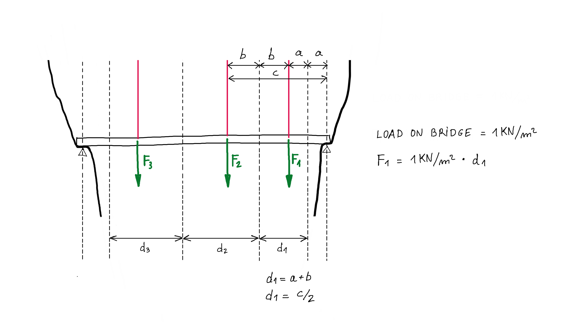
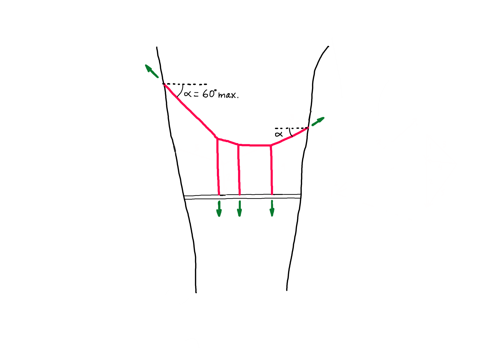

# Exercise


Complete the tasks below, and submit **by 9:00am on Friday, November 4th one zipped folder** that includes:

1. the Grasshopper definition file (only one file!)
2. and the PDF

Please follow the file naming convention as shown in the [**Syllabus**](../../syllabus.md#submissions).

### ****[**Submit here**](https://polybox.ethz.ch/index.php/s/8RZsMPMEJtOrDho)****


## Tasks

Complete the following five tasks.


Use the Rhinoceros and Grasshopper files from the tutorial as a base to solve the tasks. Then, answer the questions in the docx file. You will find all these files [**here**](./#files).&#x20;


### 1. Additional load

In tutorial 3 we created a parametric model, which, using graphic statics, finds the form of a funicular structure supporting a bridge deck. In this first model, we considered two loads representing the self-weight of the bridge. This exercise consists of adding a third load on the bridge deck.


Before adding the anchor point of the third load, pay attention first to how the loads are ordered along the bridge deck in tutorial 2.


### 2. Change of rise

In tutorial 3 we showed how to change the rise of the funicular structure modifying the geometry of the form diagram. Find now a way to achieve the same thing this time by modifying the geometry of the force diagram. The key to do this is explained in [tutorial 3](tutorial-3.md#4.-changing-the-rise).


You can use the initial Grasshopper file to solve this task. However, if you use the Grasshopper definition with three loads you created in Task 1 as a base you will get more interesting results.


### 3. Tributary areas

In the algorithm shown in tutorial 3, the magnitude of the loads is defined with a number slider. For this reason, this value is valid no matter where along the bridge deck this load is located. Find out how the magnitude of the loads can respond to the tributary areas, so that each cable supports its respective part of the bridge deck. The scheme below shows you how to calculate the tributary areas for the different cables. Consider a self-weight of 1kN/m2.


You can use the initial Grasshopper file to solve this task. However, if you use the Grasshopper definition that includes Tasks 1 and 2 you will get more interesting results.


### 4. Constrained force diagram

In addition to the pedestrian bridge, the hanging funicular structure, along its curved shape, will also be used as a bridge for a via ferrata as shown in the reference picture below.

To design our "stairway to heaven", we will consider two constraints:

1. The angle of the steepest sections must not exceed 60 degrees in relation to the horizontal (see sketch below).
2. The funicular must work fully in tension.


You can use the initial Grasshopper file to solve this task. However, if you use the Grasshopper definition that includes Task 1 you will get more interesting results.


### 5. Design exploration

Design two bridge structures and explain why you find these interesting. Finally, find the form a third rare structure in equilibrium. There are some families of solutions which lead to very strange result in equilibrium. Will you find them?


Take into account that the largest design space is in the model that includes Tasks 1, 2 and 3.

