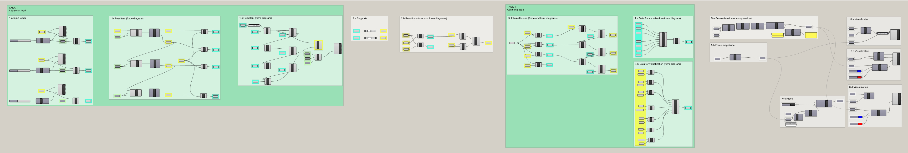

# Solution

## Task 1

<figure><figcaption></figcaption></figure>

<figure><figcaption></figcaption></figure>

## Task 2

<figure><figcaption></figcaption></figure>

<figure><figcaption></figcaption></figure>

## Task 3

<figure><figcaption></figcaption></figure>

<figure><figcaption></figcaption></figure>

## Task 4

<figure><figcaption></figcaption></figure>

<figure><figcaption></figcaption></figure>

## Task 5

<figure><figcaption></figcaption></figure>

 

<figure><figcaption></figcaption></figure>

