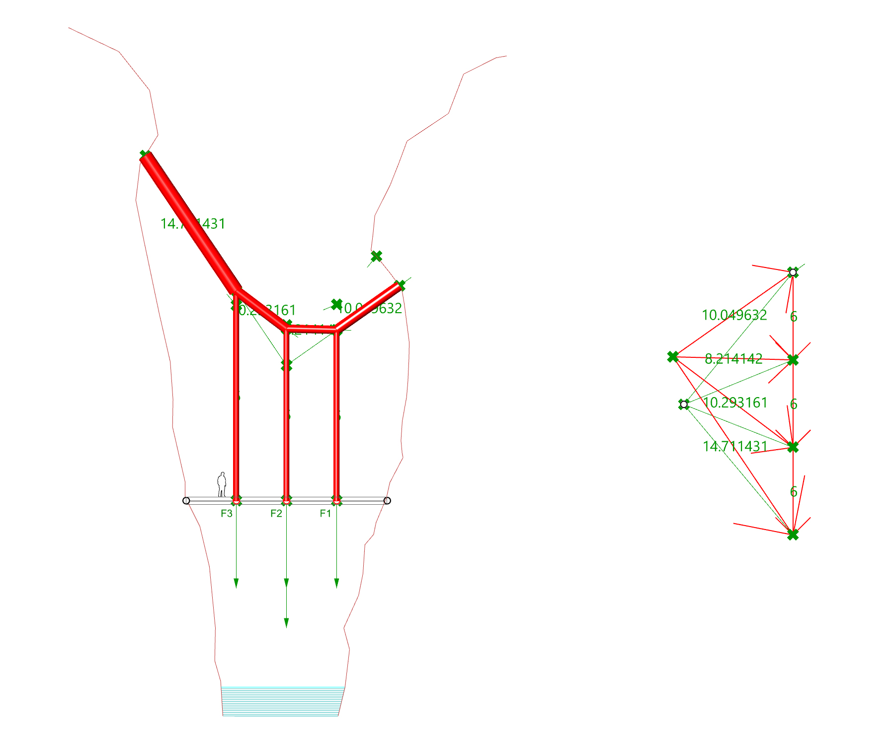
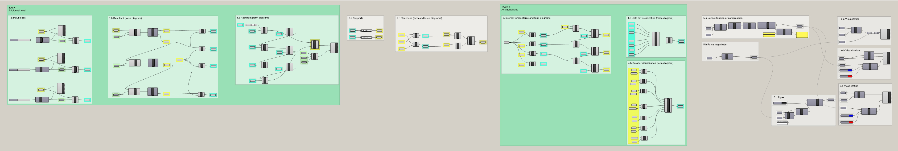
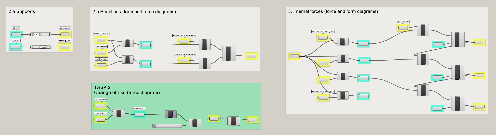
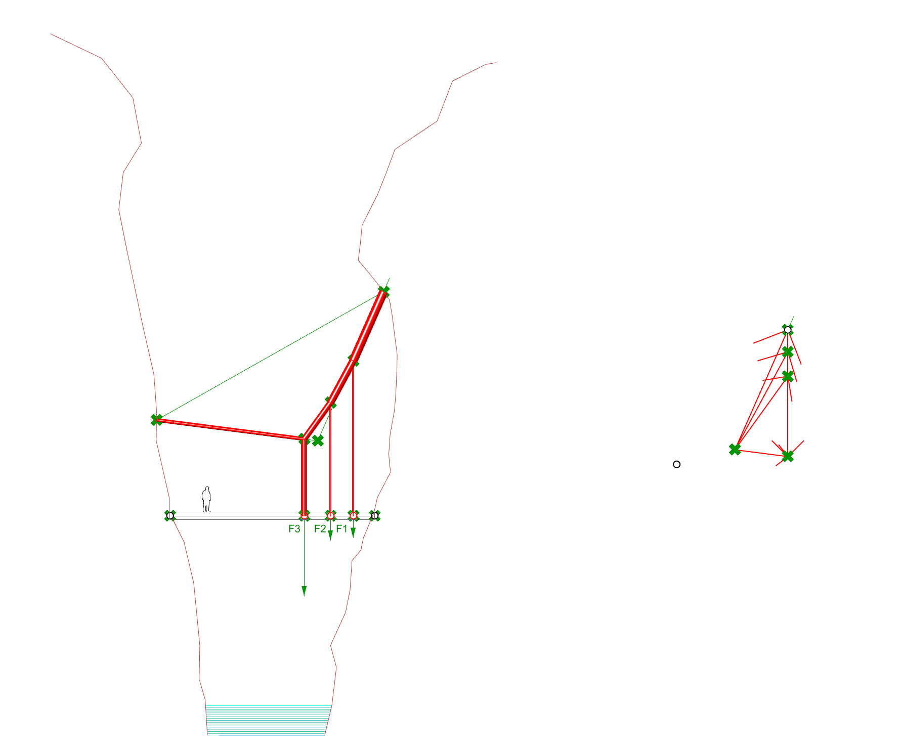
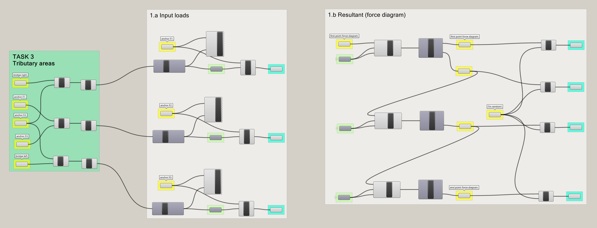
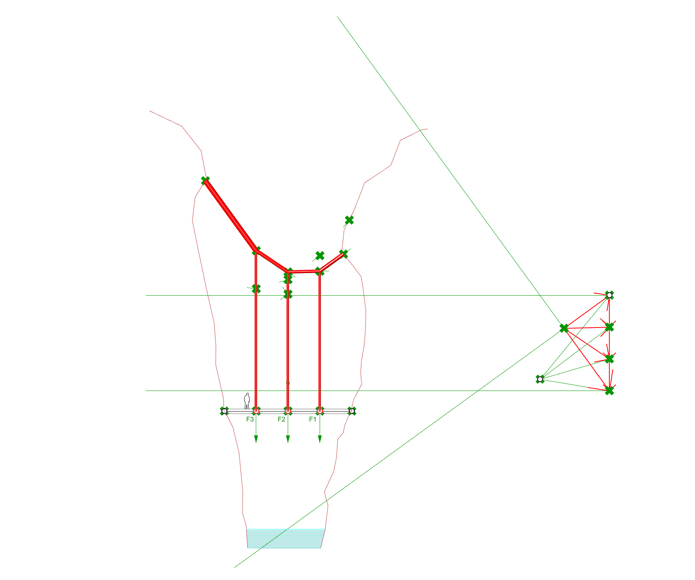
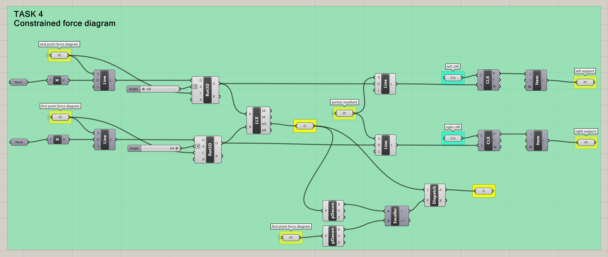
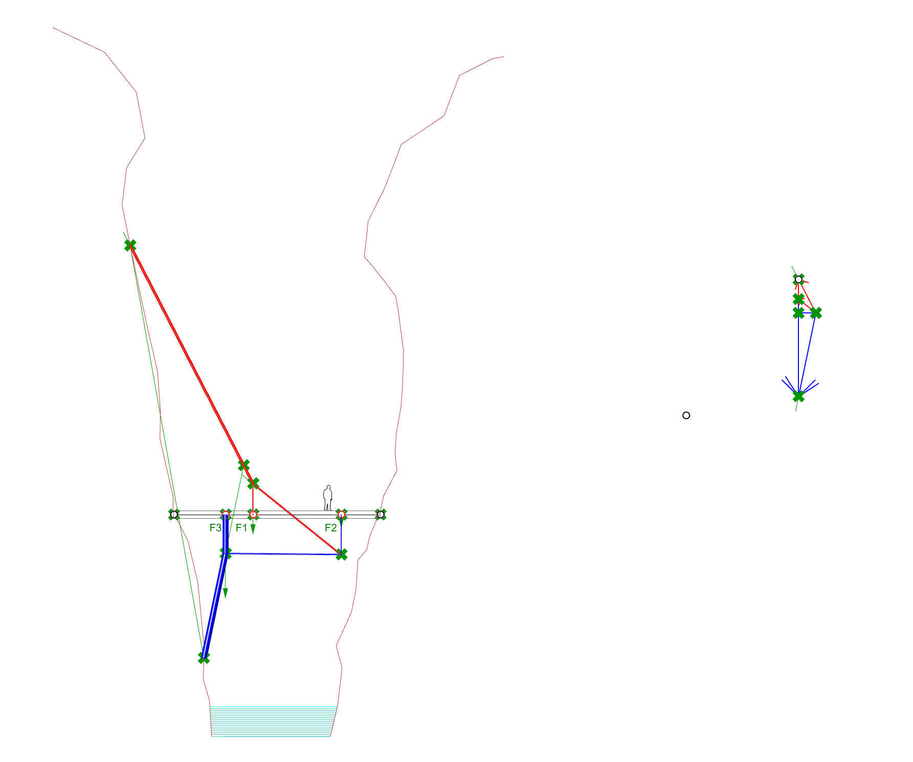
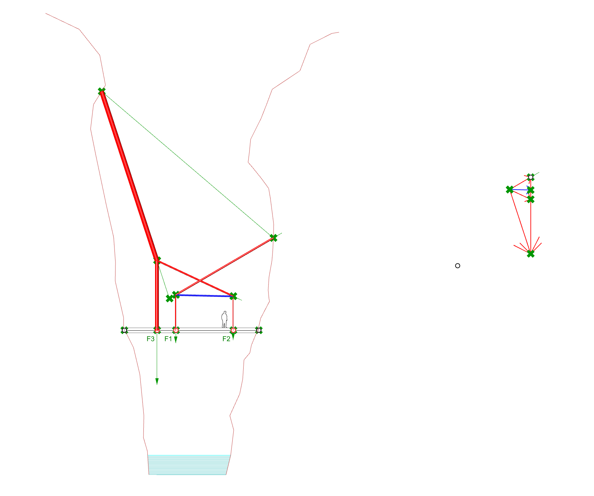

# Solution

## Task 1

To add one more external load to the model, we must modify the following parts of the algorithm: 1.a Input loads, 1.b Resultant (force diagram), 1.c Resultant (force diagram), 3. Internal forces and 4. Data for visualization. &#x20;

<figure><figcaption></figcaption></figure>

<figure><figcaption></figcaption></figure>

## Task 2

To change the rise using the force diagram, we must move O2 in the direction of the closing string.&#x20;

<figure><figcaption></figcaption></figure>

<figure><figcaption></figcaption></figure>

## Task 3

Task 3 asks you to consider the tributary areas, which affects the part 1.a. Input loads. In the initial Grasshopper definition, the magnitude of the loads is defined using a number slider that has nothing to do with the tributary areas. The solution shown below consists on measuring the distance of the part of the bridge that each anchor supports. As the area load of the bridge is 1kN/m2, we can directly use the numeric value of the distance as the load magnitude.

<figure><figcaption></figcaption></figure>

<figure><figcaption></figcaption></figure>

## Task 4

In Task 4 we must add two constraints to the force diagram to find a particular family of equilibrium solutions. The task asks you to find solutions in which the bar elements of the funicular aren't steeper than 60° and are only in tension.

#### First constraint

If we study the solutions that we obtain in the initial Grasshopper definition, we observe that the steepest elements are always at the extremes of the funicular and that their geometry is fixed when the supports are defined. In order to solve this task, instead of defining the supports and reaction forces in the form diagram, you will do this using the force diagram. The sketch below shows how to do this. Once we find a possible solution in the force diagram we will construct the form diagram and find the position of the supports along the curves of the cliffs.

<figure><figcaption></figcaption></figure>

#### Second constraint

In order to make sure that the solution is only in tension, the point O' must be to the left of the resultant. We can then simply check the x coordinate of O', compare it to that of any point lying along the line of action of the resultant and only allow solutions in which the x coordinate of O' is smaller.

<figure><figcaption></figcaption></figure>

<figure><figcaption></figcaption></figure>

## Task 5

The algorithm is able to generate families of solutions that we could not expect when we started building the equilibrium model. Some of these are not only interesting for their surprising geometries in equilibrium but also because their internal forces are low.&#x20;

<figure><figcaption></figcaption></figure>

 

<figure><figcaption></figcaption></figure>

