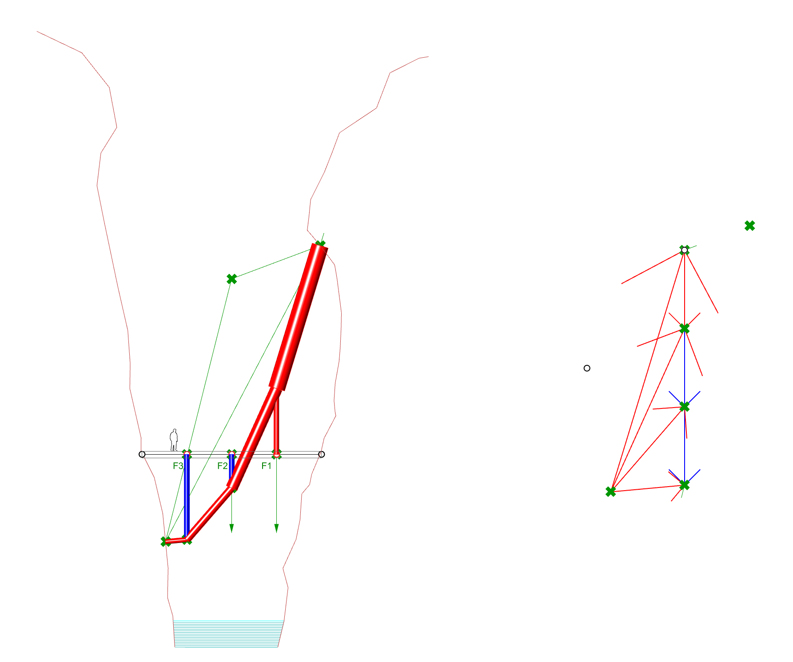

# Solution

## Task 1

To add one more load to this model, we must modify the following parts of the algorithm: 1.a Input loads, 1.b Resultant (force diagram), 1.c Resultant (force diagram), 3. Internal forces and 4. Data for visualization. &#x20;

<figure><figcaption></figcaption></figure>

<figure><figcaption></figcaption></figure>

## Task 2

To change the rise using the force diagram, we must move O2 in the direction of the closing string.&#x20;

<figure><figcaption></figcaption></figure>

<figure><figcaption></figcaption></figure>

## Task 3

To take into account the tributary areas, we only need to modify the way we input the magnitude of the external loads.&#x20;

<figure><figcaption></figcaption></figure>

<figure><figcaption></figcaption></figure>

## Task 4

This task asks you to constrain the design space to those solutions fully in tension whose elements are not steeper than 60 degrees in relation to the horizontal. If you observe a funicular system, you soon realize that the steeper elements are always those in the extremes, meaning those in contact with the cliffs. In the algorithm of the tutorial, these are defined in the form diagram when choosing freely the position of the supports along the cliff curves. To solve this task we will have to reverse the form-finding process and go from force diagram to form diagram. We will define the geometry of the extreme elements (and therefore also the reaction forces) in the force diagram, where we can easily apply the 60 degrees constraint. &#x20;

<figure><figcaption></figcaption></figure>

<figure><figcaption></figcaption></figure>

## Task 5

The algorithm is able to generate families of solutions that we could not expect when we started building the equilibrium model. Some of these are not only interesting for their surprising geometries in equilibrium but also because their internal forces are low.&#x20;

<figure><figcaption></figcaption></figure>

 

<figure><figcaption></figcaption></figure>

