## Task 1: Analysis of trusses

Truss 1: 
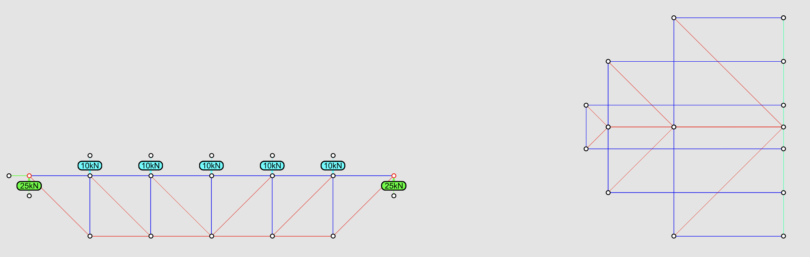
Compared with the truss in tutorial 2. Analysis of a truss, the members in tension are in compression; the members in compression are in tension. A truss under uniform loading behaves like a beam, the top is always in compression and the bottom is always in tension. 

Truss 2: 
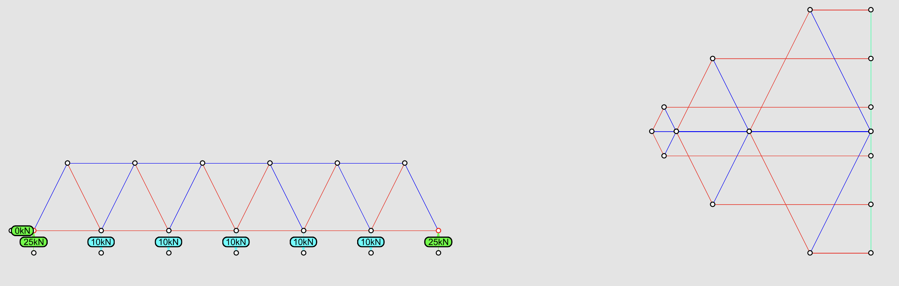
A cantilever truss will have tension in the top chord and compression in the bottom chord. Here are some possible solutions. 
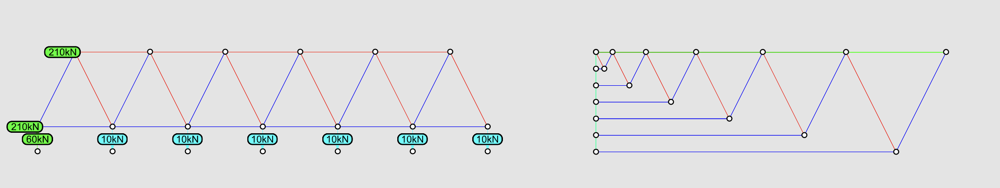
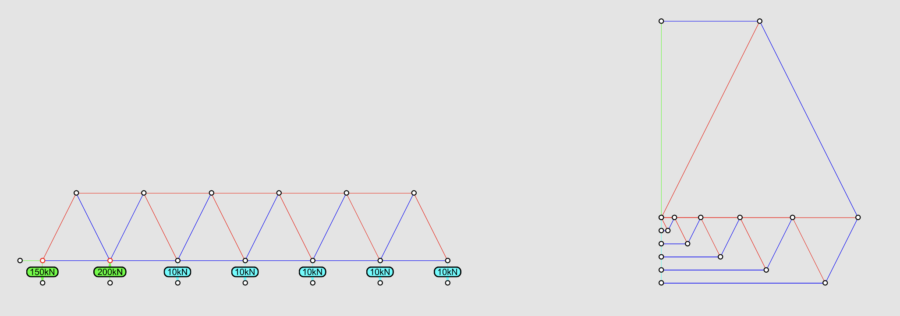

Truss 3: 
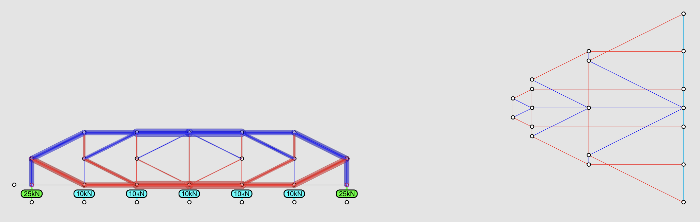
The largest forces in the top chord and the bottom chord are located in the middle of the span. The force magnitude is 40 kN. The largest forces in the diagonals are near the supports. The force magnitude is 28 kN. 
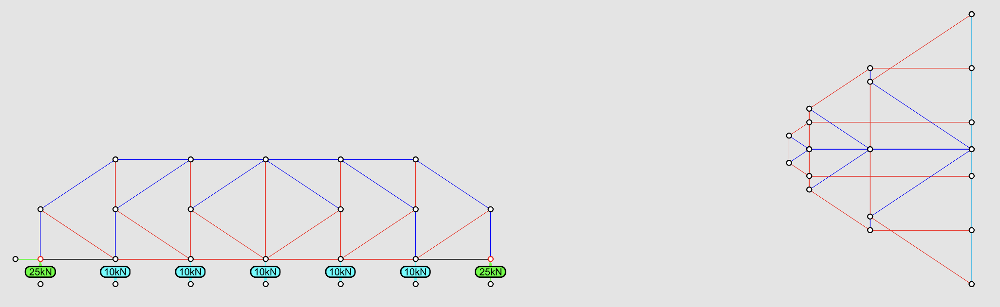
The forces in the members can be reduced by increasing the height of the truss, 

## Task 2: Cantilever arch-cable structure

Construct the arch-cable
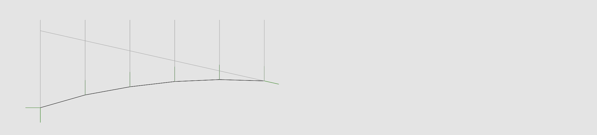
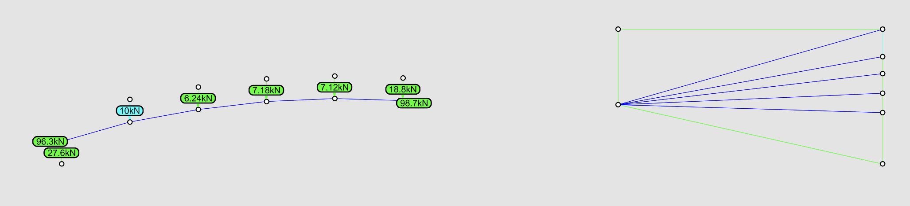
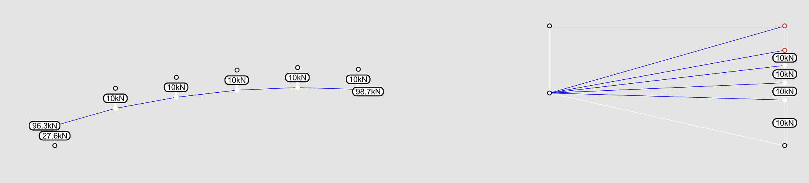
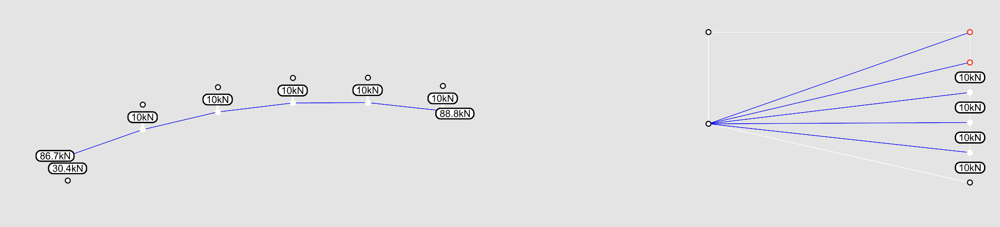
1. form find the arch
2. complete the arch-cable
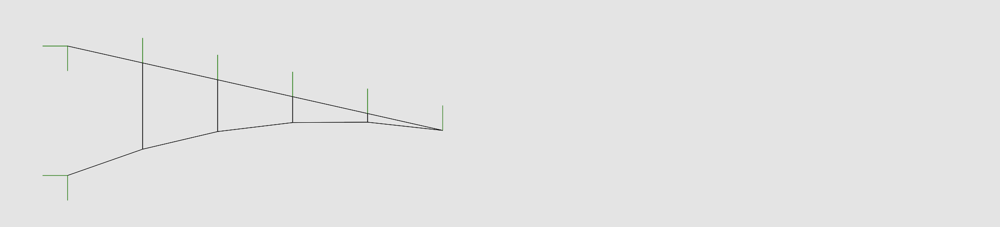
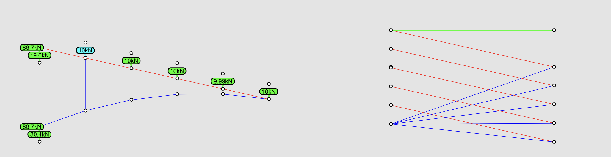

Arch-cable under non-uniform load
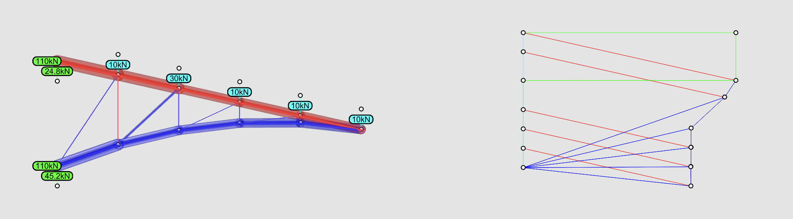

Constant force in the lower chord
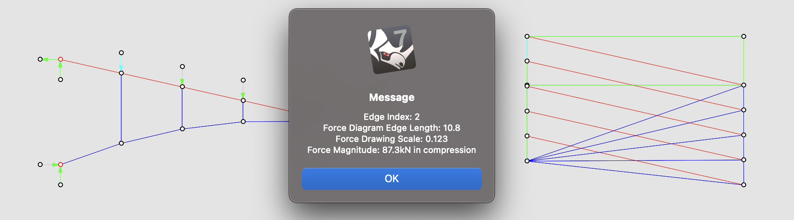
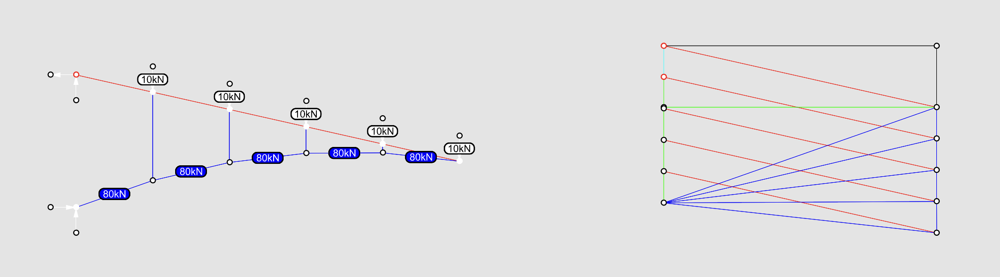
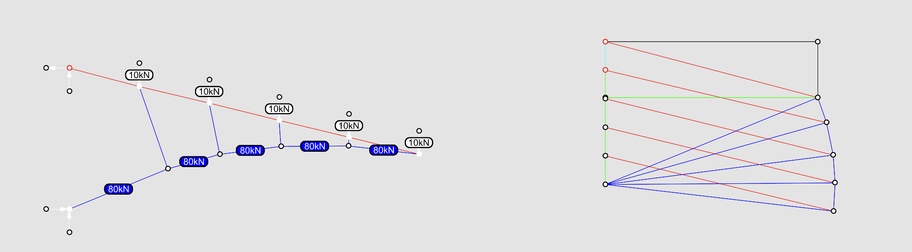

reason why need to be fixed
We need to allow one support to move. 

over-constraint
1. Fix only one support on the cliff.
2. Add default constraint, this will:
   - fix orientation of reactional forces and external loads
   - vertices where external loads are applied remain on the line of action of the load
   - fixed support remain in place
3. The support that is not fixed should remain on the vertical cliff. Thus, it can only move upwards or downwards. Use vertex constraint, select the support, and keep it in y direction. 
4. Now you can assign a target constant force in the bottom chord. You can first check the forces in the bottom chord, and estimate a target force. Apply target forces in the bottom chord. 
5. Update both diagrams. 