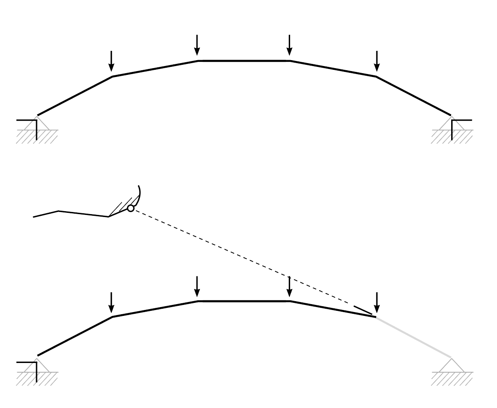
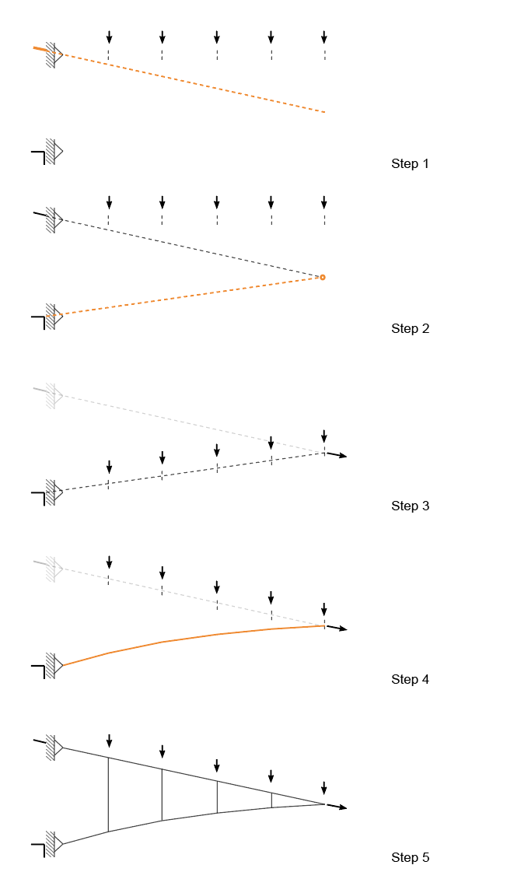
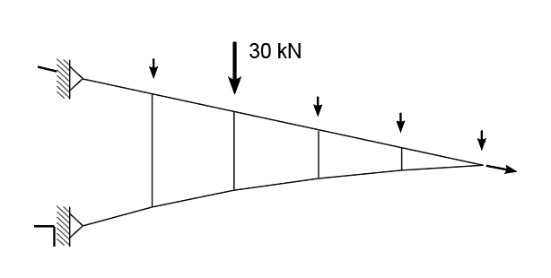

# Exercise


Complete the tasks below, and submit **by 9:00am on Friday, December 2nd one zipped folder** that includes:

1. the Rhinoceros file.
2. 3 IGS session file.
3. The completed PDF.

Please follow the file naming convention as shown in the [**Syllabus**](../../syllabus.md#submissions).

### ****[**Submit here**](https://polybox.ethz.ch/index.php/s/xB0jt4XbfkHXWIk)**** (TODO)
 


For **each task** save the IGS session file. Rename them as `exercise-4_task_1_Name.igs`.



## Tasks
Complete the following 1 theory task and 3 tasks using IGS.&#x20;

# Task 0: Theory: Static determinacy

In the lecture, we have learned the concept of static determincy. Identify the following four structures (Fig-1-1). Is it a cable / arch, arch-cable or truss? Is it unstable, statically determinate or statically indeterminate systems? 

# Task 1: Analysis of truss bridges

In the first task, you will analyse and modify 3 trusses. 

Assume that: 
* The total weight applied to the central portion of the deck is 50 kN. They are distributed equally: 10 kN at each loaded node.
* All the trusses have a pin support (fixed in X and Y) in the left and a roller support (fixed Y) in the right.
* The position of the supports can be either on the upper chord or on the lower chord. 

Here are the three truss(Fig-1-1): 
1. Truss bridge with N diagonals
2. Truss bridge with V diagonals
3. Truss bridge with K diagonals

You need to: 
* Compute the form and force diagrams of the three trusses. 
* Compare the truss 1 with the truss we have analysed in tutorial 2. Analysis of a truss. List the difference between the two trusses.
* Change the support locations of truss 2 so that the top chord is in tension and the bottom chord is in compression. Modify the input lines for truss 2 and compute the form and force diagram.
* In truss 3, which members of the top and bottom chord have the largest forces? Which members in the diagonals have the largest forces? What are the force magnitudes in these members? Perform a geometric modification of truss 3 so that the internal forces in the members are reduced. 

# Task 2: Cantilever arch-cable structure under uniformly distributed load 

Here's a comparison between an arch and a cantilever arch-cable under 4 external loads. Remove the rightest member in the arch, follow its direction, and find the correct anchor point. 

In task 2, we will build a 15.0m cantilever arch-cable viewing platform on a cliff. 

Assume that:
* The total weight applied to the deck is 50 kN, assume that the deck is divided in 5 pieces such that the load of 10 kN should be applied at each loaded node.
* The supports can be anchored anywhere on the cliff. 
  

The steps to construct the antilever arch-cable viewing platform are described as followed. 

1. Define two anchor points on the cliff and the direction of the reaction force. 
2. Find the rightest point in the arch. 
3. Form find the arch under self weight of the deck. 
4. Transfer the load on the arch to the upper chord.
5. Construct the arch-cable using the form-found arch. 

Based on your form-found arch-cable structure, answer the following questions. 
* Assume that the load on the structure is no longer uniform. Could you propose a modification so that the structure is stable under the following loads (Fig-1-4)? Hint: Topological modification is allowed. 

* Assume that we want to achieve constant force in the lower chord. Is it possible to find a design solution considering the current support locations? If it's possible, compute the final results. If it's not possible, could you propose a solution so that constant force can be achieved? 
Hint: changing the support locations and cantilevering span is allowed.

# Task 3: Design your bridge

In task 3, we will build a bridge connecting the left cliff and the right island(Fig-1-4). The distance between the left cliff and the middle island is 30 meters. The distance between the middle island and the right island is 15 meters. 

Assume that:
* The weight of the deck is 5 kN/m. The weight should be equally distributed along the span. However, you are free to divide the deck in as many slices as you want.

* Due to the soil property, the bridge cannot be anchored on the right island. You are allowed to anchor anywhere on the left cliff, and on the peak of the middle island. The deck that is supported by the middle island and hangs over the right island can be longer than 15 m. 

* In your design the deck does not need to remain horizontal.
  
* Be creative :) 

Propose two bridge designs. One should be made of trusses, and the other one of arch-cable. 

## Deliverables

Please submit the following elements:

1. Five .igs files corresponding to the structures analysed throughout the 3 tasks.&#x20;
2. The PDF-Document with your answers and screenshots. \
   _The **formatting** must be kept **clean** and the **word limits** must be respected._
3. (optional) the Rhino (.3dm) file with the structures in separate layers.\
   _For each completed structure before clearing the scene to initiate the next one you can copy the layer_ `IGS>>FormDiagram` _and_ `IGS>>ForceDiagram` _and rename them, for example as_ `IGS_task1_A>>FormDiagram`  and `IGS_task1_A>>ForceDiagram` in _this way they will not be deleted as you move on to the next task. This is a great way to keep track of your advances in the extecise_