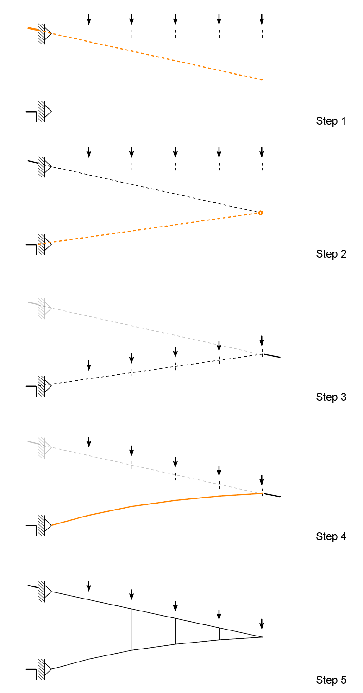

# Exercise

## Exercise


Complete the tasks below, and submit **by 9:00 am on Friday, December 2nd, one zipped folder** that includes:

1. the Rhinoceros file containing all the form and force diagrams.
2. 3 .igs session file.
3. The completed PDF.

Please follow the file naming convention as shown in the [**Syllabus**](../../syllabus.md#submissions).

#### [**Submit here**](https://polybox.ethz.ch/index.php/s/4Am1YGniSK1xRNL)



For **each task,** save the .igs session file. Rename them as `ex-4_task_1_Name.igs`.


## Save and load .igs session.

In COMPAS toolbar, you can save the working session using button  and load the session using button .png>). For task 1 , 2, 3, after you finish every task, please save the working session.&#x20;

## Task 0: Theory: Static determinacy

In the lecture, we learned the concept of static determinacy. Identify the following four structures (Fig-0-1). Is it a cable/arch, arch-cable, or truss? Is it unstable, statically determinate, or statically indeterminate systems? For the first three structures, calculate their degree of freedom.&#x20;

## Task 1: Analysis of trusses

In the first task, you will analyze and modify 3 trusses.

Assume that:

* The total weight applied to the deck is 50 kN. They are distributed equally: 10 kN at each loaded node.
* All the trusses have a pin support on the left and a roller support on the right.
* The position of the supports can be either on the upper chord or the lower chord.

Here are the three trusses (Fig-1-1):

1. Truss 1 with N diagonals
2. Truss 2 with V diagonals
3. Truss 3 with K diagonals

You need to:

* Compute the form and force diagrams of the three trusses.
* Compare truss 1 with the truss we have analyzed in [tutorial 2. Analysis of a truss](iv.-tutorial.md#2.-analysis-of-a-truss). List the difference between the two trusses.
* Change the support locations of truss 2 so that the top chord is in tension and the bottom chord is in compression. Compute the form and force diagram.
* In truss 3, which members of the top and bottom chords have the largest forces? Which members in the diagonals have the largest forces? What are the force magnitudes in these members? Perform a geometric modification of truss 3 so that the internal forces in the members are reduced.

## Task 2: Cantilever arch-cable structure

Here's a comparison between an arch and a cantilever arch-cable under 4 external loads. If you remove the member on the right and find the intersection between its extension and the anchoring obstacle, you will find the correct anchor point to anchor the cable, and the cable can carry the loads originally in the member. (Fig-2-1)

In task 2, we will build a 15.0m cantilever arch-cable viewing platform on a vertical cliff.&#x20;

Assume that:

* The total weight applied to the deck is 50 kN. Assume that the deck is divided into 5 pieces such that the load of 10 kN should be applied at each loaded node.
* The supports can be anchored anywhere on the cliff.&#x20;

The steps to construct the cantilever arch-cable are described as follows (Fig-2-2).

1. Define two anchor points on the cliff and the direction of the reaction force.
2. Find the support of the arch on the right side.
3. Form find the arch under the self-weight of the deck. (Hint: [Tutorial 3. ](iv.-tutorial.md#3.-analysis-and-form-finding-of-an-arch-under-uniformly-distributed-load)Analysis and form finding of an arch under uniformly distributed load)
4. Transfer the load on the arch to the upper chord.
5. Rebuild the entire geometry and analyze it again in IGS to obtain the final force diagram.

Based on your form-found arch-cable structure, answer the following questions.

* Assume that the load on the structure is no longer uniform. Could the arch-cable cantilever structure take non-uniformly distributed loads? If not, could you propose a modification to stabilize the structure under the following loads (Fig-2-3)? (Hint: Topological modification is allowed)

* Assume that we want to achieve constant force in the lower chord. Is it possible to find a design solution considering the current support locations? If it's possible, compute the final results. If it's not possible, could you propose a solution to achieve constant force? (Hint: changing the support locations is allowed)

## Task 3: Design your bridge

In task 3, we will build a bridge connecting the left cliff and the middle island, and a cantilever viewing platform (Fig-3-1). The distance between the left cliff and the middle island is 30 meters. The cantilever span is 15 meters.

Assume that:

* The weight of the deck is 5 kN/m. The weight should be uniformly distributed along the span. However, you can divide the deck into as many slices as you prefer.
* You can anchor anywhere on the left cliff and the middle island.
* In your design, the deck does not need to remain horizontal.

Propose two bridge designs.&#x20;

* In the first design, the bridge and the viewing platform are two independent structures. One of them should be an arch-cable, and the other one should be a truss.&#x20;
* In the second design, the bridge and the viewing platform have to be a single structure. Solve it using a combination of a truss and an arch-cable, or only arch-cables.

