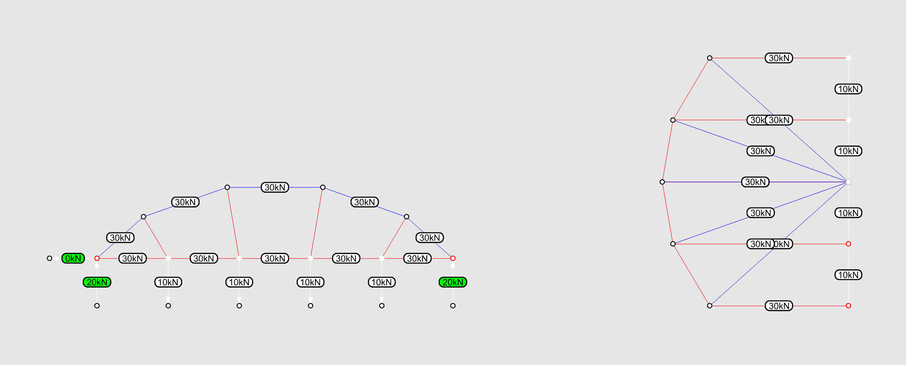

# Tutorial

## Learning goals

* analyze 2-dimensional truss structures using algebraic graph statics
* form-find funicular arch-cable structures using restrained algebraic graph statics

## Content

We have learned how to find a form under variable loads using procedure graphic statics. However, when we want to modify the initial setup of the drawing, such as the number of structural elements and the connectivity, we need to modify a large amount of the program or even reconstruct the entire procedure. This process can be time-consuming and requires profound familiarity with geometric construction knowledge. This week we will algebraic graphic statics to analyze 2-dimensional trusses, as well as form-find funicular and arch-cable structures.

## 1. Analysis of a simple truss

Let's start with the following example of the simple truss. The geometry, loads, and support conditions are depicted in Fig-1-1. The left load is 30 kN, and the right is 10 kN.

### **1.1 Making the form diagram**

In the Rhino file, the lines of this truss are already drawn as Fig-1-2(top-left). The fixed support is represented by two reaction forces in the x and y directions. The roller support is represented by a reaction force in the y direction. Two unsymmetrical external forces are simplified as two lines in the orientation of the forces.

In the toolbar of IGS2, click the button  (1) (1) (1) (1) (1) (1) (1) (3).png>) `Create Form Diagram` and select the option `FromLines`. The FormDiagram will be created as Fig-1-2(top-right). You can notice a difference in the color of the **internal edges** (structure) and **external edges** (loads and reactions). The Form Diagram edges are drawn in the current layer.


The input lines will be hidden from the canvas to avoid overlap with the newly created Form Diagram. If you need to view them again, you need to type the command `Show` in Rhino. The input edges should remain hidden during this tutorial.


Supports should be assigned to the nodes where reaction forces are applied. Click  (1) (1) (1) (1) (1) (1) (2).png>) `Identify Anchors` and select the two nodes in the base of the single panel. These nodes will be highlighted in red(Fig-1-2(bottom-right)).

The system has `m=10` edges and `ni=4` internal nodes. According to the definition of static determinacy, `DOF = m - 2*ni = 10 - 2*4 = 2`. We need to assign two forces. In IGS, you can also click the button .png>) `Check DoF` to check the required number of forces that should be selected. Click  (1) (1) (1) (1) (1) (1) (1).png>) the `Assign Forces` button. Select the two edges representing the loads and apply a magnitude of **-30 kN** to the left load and **-10 kN** to the correct node. For the forces, the negative sign means the force is pressing against the node; the positive sign means pulling away the node. You can identify the left and right edges by the displayed numbers in edge labels. After we hit OK, the forces applied are shown on the edges with an arrow(Fig-1-2(bottom-left)). Verify that the arrow direction corresponds to the desired direction of the applied loads.

After you have assigned the forces, you can click the button .png>) `Check DoF` again to make sure that you have assigned the right number of forces.

### **1.2 Computing the force diagram**

After setting the load, we can compute the equilibrium by calculating the force diagram with the button  (1) (1) (1) (1) (1) (1) (1) (2).png>) `Create Force Diagram`. The force diagram is automatically generated right to the form diagram. The result should be as shown in Fig-1-3.

Note that the reaction forces now also display the value and direction. The default visualization for form and force is the red-blue coloring. **Blue** represents **compression** and **red** represents **tension**. At this point, the scale and location of the force diagram are automatically set by IGS.

In procedure graphic statics, the magnitude of the force is equal to the length of the force diagram. In IGS, the force diagram is automatically scaled based on the size of the form diagram, in case the user accidentally assigns a tremendous axial force. To analyze the magnitude of the forces in specific edges, two options are available in the button  `Inspect Diagrams`. An **EdgesTable** can be displayed with information about all the forces in the structure(Fig-1-4). Additionally, information about one specific edge of the structure can be queried with the option **EdgeInformation** (Fig-1-5).

<figure><figcaption>
Fig-1-4
</figcaption></figure>

For the Form Diagram, pipes can be drawn in the edges with thickness proportional to the load carried (Fig-1-6). The settings can be found in COMPAS toolbar uder the button `Scene Objects`. Choose `Settings` for the FormDiagram and check `show >> forcepipes`.

***

####

## 2. Analysis of a truss

Here we will look into a warren truss(Fig-2-1). The forces applied at each node have a magnitude of 10 kN.

### **2.1 Making the form diagram**

As in the first example, at the IGS toolbar go to  (1) (1) (1) (1) (1) (1) (1) (2).png>) `Create Form Diagram` and select the option `FromLines` . Use  (1) (1) (1) (1) (1) (1) (1) (2).png>) `Identify Anchors` to select the support nodes. This form diagram is composed of `m=29` edges and `ni=12` internal nodes. Therefore we can specify the force in 5 edges (`DOF = m - 2*ni = 29 - 2*12 = 5`). Use  (1) (1) (1) (1) (1) (1) (1) (2).png>) `Assign Forces` to select 5 forces and input the corresponding force of +**10 kN**. (Fig-2-2) Use `Check DoF` to verify that you have assigned the right number of forces.

### **2.2. Computing the force diagram**

After setting the load, we can compute the equilibrium by calculating the force diagram using the button  (1) (1) (1) (1) (1) (1) (1).png>) `Create Force Diagram`. The force diagram is automatically generated right to the form diagram. The result should be as below (Fig-2-3).

The sum of external forces are `10 * 5 = 50 kN`. Turn on the hidden Rhino layer `Tutorial >> Guides`, you will find a 5m\*5m box. Now scale the force diagram so that 1m represents 10kN. The scale and location of the diagram can be set using the commands `IGS2_force_move` and `IGS2_force_scale`**.** The scaled force diagram will appear as in Fig-2-4.

### **2.3 Modification of form diagram**

Geometric modifications, such as dragging nodes in the form diagram, can be executed with the button  `Move FormDiagram Nodes`. Once one modification is performed, the force diagram can be updated by pressing the button  `Update ForceDiagram from FormDiagram`.

One example of modification is done below: we move up one of the nodes of the structure. As a result, a large force is attracted to the edge connected to it. This higher magnitude can be seen due to the increased size shown by it in the force diagram (Fig-2-5).

If we increase the height of our truss, the internal forces decrease (Fig-2-6).

<figure><figcaption>
Fig-2-6
</figcaption></figure>

### **2.4 Special case**

The following geometry shows a truss designed by the desired force property under uniformly distributed load (Fig-2-7). It has constant axial forces in the bottom chord. The forces in the diagonal struts are zero. In the force diagram, the endpoints representing these diagonal struts are overlaid, which means the edges are of 0 lengths. Thus, these members can be eliminated from the structure of the chords if the rest elements have sufficient strength and flexural stiffness to satisfy the demand of non-uniform load cases and stability requirements.

Now change the uniform loading to ununiform loading (Fig-2-8). The diagonal struts are no longer of 0 forces.

***

***

## 3. Analysis and form finding of an arch under uniformly distributed load

In procedure graphic statics, we use the form and force diagrams to find a funicular structure in equilibrium. Here we will use algebraic graphic statics to find an arch under uniformly distributed load (Fig-3-1). The load in each node is equal to **10 kN**.

In algebraic graph statics, we always need to start from the desired topology, which means the algorithm only works with a given geometry, and you need to make a drawing of your initial guess. The steps are shown in Fig-3-2. We assume that the two extremities are pin supports. We divide the line between two supports into 7 segments, and the points indicate the line of action of the vertical loads. Here we will use an arc of a circle as an initial guess. Intersect the vertical lines with the arc and redraw the arc as line segments. Hide auxiliary geometries and add lines that represent external forces on the nodes. This is our input geometry for the force diagram.

### 3.1 Analysis of the arch

In this case, we have a funicular arch, but the load is unknown. As long as we know one axial force in our system, we can draw the force diagram with the correct scale. We can double-check this argument via the definition of static determinacy. The system has `m=17` edges and `ni=8` internal nodes. Its `DOF = m - 2*ni = 17 - 2*8 = 1`. We need to assign only one force.

Create FormDiagram with the button  (1) (1) (1) (1) (1) (1) (1).png>)`Crerate Form Diagram` from the lines. Restrain the two extremity vertices assigning them as supports/anchors with the button  (1) (1) (1) (1) (1) (1) (1).png>) `Identify Anchors`. Assign one load, -10 kN, with the button  (1) (1) (1) (1) (1) (1) (1) (1).png>) `Assign Forces`. Press the button  (1) (1) (1) (1) (1) (1) (1) (1).png>) `Create Force Diagram` which generated the ForceDiagram highlighted in Fig-3-3.

We observe that the force 10 kN is only applied to the edge selected as the independent and the mirrored edge in the form diagram. The rest of the applied loads are different from 10 kN.

### 3.2 Constrained equilibrium under uniformly distributed load

In algebraic graphic statics, modifying a force diagram to update the form diagram sometimes is not as straightforward as you modify it manually.

Four types of constraints are possible in the current version of IGS2 (Fig-3-4)

1. **Anchor a vertex,** fixing its x and y coordinates;
2. Constraint a vertex to a **line of action**;
3. Constraint **edge direction**; and
4. Apply **target forces** in the form diagram, which reflect in target lengths in the force diagram.

.png)


Since white is the default color for the constraints, remember to change your background color. Grey is preferred. The visualization of the arch after the default constraints should look as follows:


To achieve the geometry corresponding to the uniformly distributed load from our hypothesis, we will first add default constraints. The default constraint is implicit when we do graphic statics by hand. On the form diagram (Fig-3-5):

* the vertices in the form diagram with an externally applied load are constrained to remain on the line of action of the load (constraint type 2);
* the leaf-edges (reactions or loads) have their orientation fixed (constraint type 3).

Assign the default constraint by clicking `Assign default constraints` (Fig-3-6). We wee that:

* Edges in the form and force diagrams with orientation fixed are highlighted in white.
* Vertices in the form and force diagram with line constraints are highlighted in white.
* Anchored vertices are shown in red.

Secondly, we assign **target forces** to the load edges with the same magnitude as the applied load. This reflects as a constraint on the **target length** of the dual edges in the force diagram. To assign these additional constraints click on the button  (1) (1) (1) (1) (1) (1) (1) (4).png>) `Assign edge constraints` and select the option `ForceMagnitude`. Select all applied loads and give the target magnitude (10 kN). The sign +/- is not essential here since it will always take the same sign of the applied load. The target forces will show in white in the form and force diagrams (Fig-3-7).

Now, we apply constraints to the form and force diagrams which forces them to look for a new equilibrium. Now we can update the form and force diagrams (bi-directional update). Type command `COMPAS_settings`, and check `bi-directional`. If you don't turn bi-directional on and press `Update Both Diagrams`, you will receive an error message.

Now that the bi-directional module is activated, you click on `Update Both Diagrams`. Both diagrams will update, and the result should be as displayed below (Fig-3-8):

The funicular form for a uniformly distributed load is shallower than the original. The geometry is a parabola instead of an arc of a circle.


The constraints can be turned on and off. In the latter, the original force in the edge is displayed. Additionally in the `Inspect diagrams > ConstraintsTable` a table is called showing all constraints, the current force in the edges, as well as the constraints in the vertices applied.

The constraints can be erased from the form using the command `IGS2_form_constraint_edge_remove`.



If you use insufficient constraints, sometimes you will achieve some solutions in equilibrium but not the solutions you want (Fig-3-9). However, in most cases, the solver will not converge properly, and you will receive a warning.


<figure><figcaption>
Fig-3-9
</figcaption></figure>

### 3.3 Updating the support

If the constraints are not erased or are reassigned, more modifications could be done on top of the current design. We will explore two simple ones. In the first modification, we move the right support, and the reaction forces 3m up (Fig-3-10). Click the button .png>) `Move FormDiagram vertices`, select the 3 nodes at the right support and move them.

We then press the button  (1) (1) (1) (1) (1) (1) (1).png>) `Update Both Diagrams` and both diagrams will be matched according to the constraints and the new support position. The resultant structure is still a funicular for the uniformly distributed load case but with supports in different elevations, which makes the vertical reaction forces unbalanced (Fig-3-11).

The second modification imposes an additional target force on one of the reaction forces. Here we set the horizontal reaction force to have a magnitude of 25 kN. As a result, the funicular arch changes its height. In the force polygon, the horizontal reaction force has its length decreased. The following image shows the result of this modification (Fig-3-12).

<figure><figcaption>
Fig-3-12
</figcaption></figure>

###

## 4. Analysis and form finding of an arch-cable structure of constant force in the chord

The form of the truss in 2.4 is found graphically by specifying a constant force of **10 kN** in the bottom chord (Fig-4-1). By examining the corresponding force diagram, we observe that the diagonal members of the truss are zero force members. Thus, we can remove these bars of 0 forces in our structure. Note that this truss is only "stable" under a uniformly distributed load.

Although such a structure can be "unstable" under variable load, we can manipulate the force diagram to explore the design space. Since the polygons in the force diagram remain closed, the form diagram is guaranteed to be in equilibrium.

We will start with the following arch-cable structure. It has `m=21` edges and `ni=10` internal nodes. Its `DOF = m - 2*ni = 21 - 2*10 = 1`.

### 4.1 Analysis of the arch-cable structure

Create the form diagram and force diagram (Fig-4-2).

<figure><figcaption>
Fig-4-2
</figcaption></figure>

### 4.2 Arch-cable with constant force in the upper chord

The truss has constant tensile forces in the bottom chord but variable forces in the upper chord. To achieve constant force in the upper chord graphically, we will draw a circle in the force diagram. The radius of the circle is equal to the constant force. Intersect the circle with the horizontal lines that represent the bottom chord, and connect the center of the circle with the intersection points (Fig-4-3).

Now we will impose constraints to form-find the arch cable, such as the edges in the top chord having constant force.

Firstly, the default constraints affect the leaf edges (loads and reactions) and the vertices connected to them. This can be done by pressing the button  `Apply Default Constraints`.

Secondly, we assign target forces to the top chord. In the button  (1) (1) (1) (1) (1) (1) (2).png>) `Assign edge constraints` over the option, `ForceMagnitude` we assign 30 kN to the edges in the top chord.

Thirdly, multiple solutions for a constant top chord exist. In this part, we will initially look for the one which keeps the bottom chord flat. To do that, we click once more on the  (1) (1) (1) (1) (1) (1) (1).png>)`Assign edge constraint` button over the option `EdgeOrientation` and select edges in the bottom chord.

Finally, to preserve the load case, we assign target edges also to the applied loads. Under the function  (1) (1) (1) (1) (1) (1) (1) (1).png>) `Assign edge constraints` option `ForceMagnitude,` we assign 10 kN to the applied loads. The result looks like Fig-4-4:

Click on the button  (1) (1) (1) (1) (1) (1) (1) (2).png>) `Update both diagrams`. The result is depicted below (Fig-4-5):

### 4.3 Arch-cable with constant force in the bottom and upper chord

One additional modification will be performed. The top and bottom chords are constrained to the same target force of 30 kN. As a consequence, the bottom chord can no longer be flat. Therefore we remove that constraint using command `IGS2_form_constraint_edge_remove` and assign the target edges length to the bottom chord. (Fig-4-6)

<figure><figcaption>
Fig-4-6
</figcaption></figure>

Now, we can apply the  (1) (1) (1) (1) (1) (1) (1) (1).png>) update to form and force diagrams, and the result is the double constant truss below (Fig-4-7):

