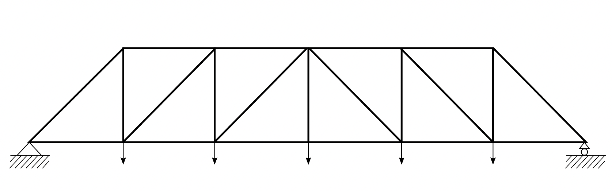
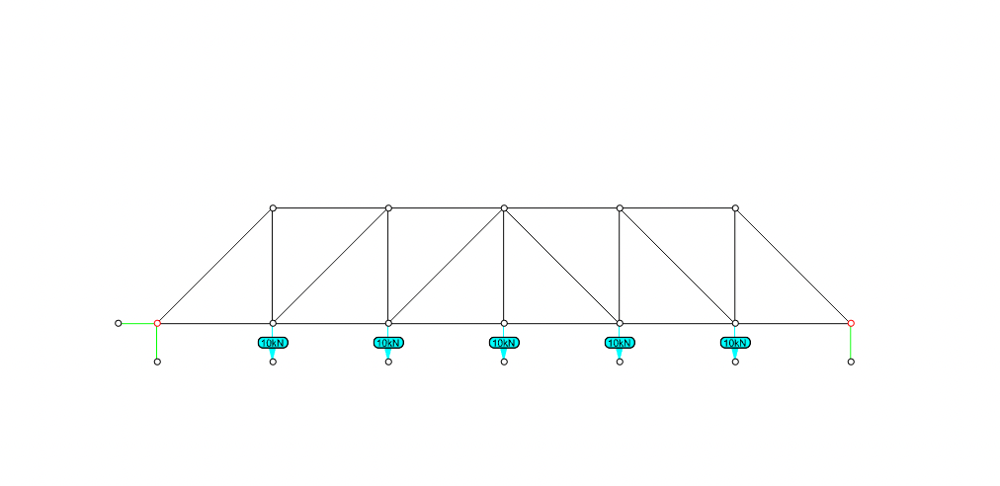

# Tutorial

## Learning Goals

* &#x20;analyze 2-dimensional truss structures with algebraic graphic statics
* form-find funicular and arch-cable structures with restrained algebraic graphic statics

## Content

We have learned how to find a form under variable loads using procedure graphic statics. However, when we want to modify the initial setup of the drawing, such as the number of structural elements and the connectivity, we need to modify a large amount of the program or even reconstruct the entire procedure. This process can be time-consuming and requires profound familiarity with geometric construction knowledge.  This week we will algebraic graphic statics to analyze 2-dimensional trusses, as well as form-find funicular and arch structures.&#x20;

## Arch-cable and Truss

###

---

## 1. Analysis of a Simple Truss

Let's start with the following example of the simple truss. The geometry, loads, and support conditions are depicted in the Fig-XXX. The left load is 30 kN and the right one 10 kN. 

    

#### 1.1 Making the Form Diagram
In the Rhino file, lines of of this truss are already drawn as Fig-XXX(top-left). The fixed support is represented by two reaction forces in x and y directions. The roller support is represented by a reaction force in y direction. Two unsymmetrical external forces are simplified as two lines in the orientation of the forces. 

In the toolbar of IGS go to the function `Create Form Diagram` and select the option `FromLines`.  The FormDiagram will be created as Fig-XXX(top-right). You can notice a difference in the colour of **internal edges** (structure) and **external edges** (loads and reactions). The Form Diagram edges are stored in a new Rhino layer - `IGS >> FormDiagram`.


The input lines will be hidden from the canvas, to avoid overlap with the newly created Form Diagram. If you need to view them again you need to type the command `Show` in Rhino, or click with the right button in the icon over the main toolbar, as shown below. The input edges should remain hidden during this tutorial.


The system has `m=10` edges and `ni=4` internal nodes. According to the definition of static determinacy, `DOF = m - 2*ni = 10 - 2*4 = 2`. We need to assign two forces. In IGS you can also click the button `Check DoF` to check the required number of forces that should be selected.
Click over the Assign Forces button. Select the two edges representing the loads and apply a magnitude of **-30 kN** to the left load and **-10 kN** to the right node. You can identify the left and right edges by the displayed numbers in edge labels. After we hit OK, the forces applied are shown in the edges with an arrow(Fig-XXX(bottom-left)). Verify that the arrow direction corresponds to the desired direction of the applied loads.

Supports should be assigned to the nodes where reaction forces are applied. Go to the function `Identify Anchors` and select the two nodes in the base of the single panel. These nodes will be highlighted in red(Fig-XXX(bottom-right)).

#### 1.2. Computing the Force Diagram

After setting the loads we can compute the equilibrium by calculating the force diagram in the button `Create Force Diagram`, the force diagram is automatically generated right to the form diagram. The result should be as FigXXX:

Note that the reaction forces now display also the value and direction. The default visualisation for form and force is the red-blue colouring. **Blue** represents **compression** and **red** **tension**. At this point, the scale and location of the force diagram is automatically set by IGS.

In procedure graphic statics, the magnitude of the force is equal to the length of the force diagram. In IGS, the force diagram is automatically scaled based on the size of the form diagram, in case the user accidently assign a gigantic axial force. 
To analyse the magnitude of the forces in specific edges three options are available in the Button `Inspect Diagrams`. An **EdgesTable** can be displayed with information about all the forces in the structure, additionally, information about one specific edge of the structure can be queried with the option **EdgeInformation**, and the duality can be inspected with the function **ForcePolygons.**

For the Form Diagram, pipes can be drawn in the edges with thickness proportional to the load carried.

---

## 2. Analysis of a Warren Truss with Vertical Supports
The second example analyses a warren truss with vertical supports(Fig-XXX). The forces applied at each node have a magnitude of 10 kN.

    

#### 2.1 Making the Form Diagram

As in the first example, at IGS toolbar go to `Create Form Diagram` and select the option `FromLines` . This formdiagram is composed of `m=33` edges and `ni=14` internal nodes. Therefore we are able to specify the force in 5 edges (`DOF = m - 2*ni = 33 - 2*14 = 5`). Therefore, we use `Assign Forces` to select 5 forces and input the corresponding force of +**10 kN**. Use `Identify Anchors` to select the support nodes. (Fig_XXX)

#### 2.2. Computing the Force Diagram

After setting the loads we can compute the equilibrium by calculating the force diagram in the button `Create Force Diagram`, the force diagram is automatically generated right to the form diagram. The result should be as below(Fig_XXX). 

The sum of external forces are `10 * 5 = 50 kN`. Turn on the hidden Rhino layer `Tutorial >> Guides`, you will find a 5m*5m box. Now scale the force diagram so that 1m represents 10kN. The scale and location of the diagram can be set in the **IGS Menu** (not IGS Toolbar) on `Display` > `ForceDiagram location` / `ForceDiagram scale` as shown in the Fig_XXX. 

#### 2.3 Modification of Form Diagram

Geometric modifications, such as dragging nodes in the form diagram can be executed with the button `Move FormDiagram Nodes`. Once one modification is performed, the form diagram can be updated by pressing the button `Update ForceDiagram from FormDiagram`.

One example of modification is done below: we move up one of the nodes of the structure, and as a result, a large force is attracted to the edge connected to it. This higher magnitude can be seen due to the increased size shown by it in the force diagram(Fig_XXX). 

If we increase the height of our truss, the internal forces decrease(Fig_XXX). 


An option to **auto-update** the diagrams is available in the display settings tabs and it is turned `OFF` by default. If `ON`, this function update the force diagram at each node movement of the form diagram.


#### Special Case
The following geometry shows a truss that is designed by the desired force property. It has constant axial forces in the bottom chord. The forces in the diagonal struts are zero. In the force diagram, the end points representing these diagonal struts are overlaid, which means the edges are of 0 length. Thus, these members can be eliminated from the structure if the chords have sufficient strength and flexural stiffness to satisfy the demand of non-uniform load cases and stability requirements. 

Now change the uniform load to ununiform load. 

#### 2.4 Load Path (maybe delete??)
Additionally, feedback on the cost of the structure can be assessed by activating the option`Compute loadpath` that shows an increase in the cost/loadpath of the structure. For Fig_XXX, 

> The total load-path of the structure is 1860.0 kNm.

For Fig_XXX(high one), 
> The total load-path of the structure is 1892.0 kNm.

## 2. Form finding of cable / cabnle-strut structures
