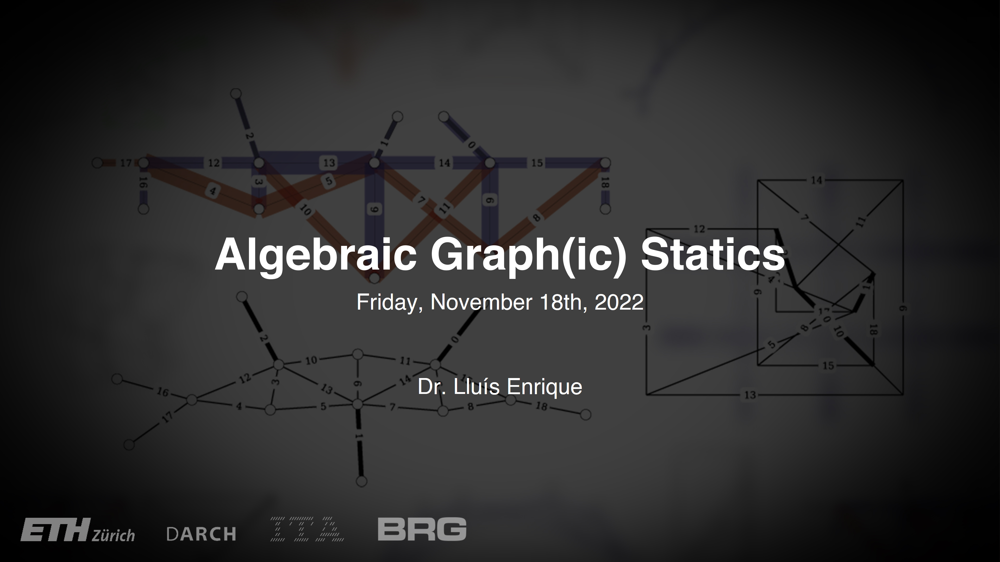

# Lecture

<figure><figcaption></figcaption></figure>

In this lecture, the central concept and main algorithm steps of Algebraic Graph(ic) Statics (AGS) are presented.


You will find the lecture pdf **here.**


