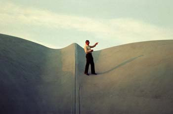

# Exercise


Complete the tasks below, and submit **by 9:00am on Friday, December 16th one zipped folder** that includes:

1. COMPAS .ui files for each task answer
2. and the PDF

Please follow the file naming convention as shown in the [**Syllabus**](../../syllabus.md#submissions).

#### \*\*\*\*[**Submit here**](https://polybox.ethz.ch/index.php/s/BA60XLsuQJdpWuj)


## Tasks

Complete the following three tasks. **A fourth task will be done during the work session**.

The goals of this task are: 
1. that you practise the basic computational procedure for form finding with rv3, including generation of input topology, defining supports, calculate horizontal eq and vertical eq. and 
2. that you study with rv3 how the internals forces flow within a classic cross vault and that you compare this with one cross vault that has an opening in the center right where the diagonals meet.


Use the Rhinoceros file named CSDI\_V\_exercise.3dm. Then, answer the questions in the docx file. You will find all these files **here**.


### 1. Creases

In the first task, you will design a shell with a square footprint which is a cross vault. Use one of the input methods we learned in the tutorial to input a topology which measures **15 m by 20 m** overall, is subdivided into a dense quadrilateral mesh, and supported at its four corners. [Follow the steps from the tutorial](\_tutorial-5.md#4-creases) to make your cross vault using either of the two methods. Save your RV3 session in this format : `V_1_a_jane-smith.ui`.

Now, make an opening at the center of the shell by reusing the same topology of your cross vault. Finish the formfinding process, then save your RV3 session in this format: `V_1_b_jane-smith.ui`.


If you are using the `FromLines` input method and would like to make your own grids of lines, some helpful Rhino commands might be `Divide`, `ArrayLinear`, and `Split`. You can also make a `Mesh` and use `ExtractWireframe` to convert it to a grid of lines.


### 2. Holes

Create a shell with an **12m by 12m** footprint which is subdivided into a **10 by 10** quadrilateral mesh and supported at its four corners. Now make two shells with this same initial topology. In one shell make an opening at the center and in the other make an opening near to a corner support.

Next, for comparison, we are going to create the shell with a hole in the center using the **triangulation** input method. Draw the linework and perform the formfinding process. 

### 3. Lip edges

For this task recreate one of the roof modules from the Heinz Isler Tennis Hall using RV3. The approximate dimensions are shown in Fig 3-3. Follow the steps from the Lip edges tutorial. Record your steps in the word doc.

<figure><figcaption>
Fig 3-1 : Heinz Isler Heimberg Indoor Tennis Hall under Construction Source: https://ascelibrary.org/doi/full/10.1061/%28ASCE%29ST.1943-541X.0000144
</figcaption></figure>

<figure><figcaption>
Fig 3-1 : Heinz Isler Heimberg Indoor Tennis Hall Source: https://darquitectura.tumblr.com/post/643438301203857408/heinz-isler-centro-de-tenis-y-piscina-cubierta-en
</figcaption></figure>

<figure><figcaption>
Fig 3-2 : Heinz Isler on Heimberg Shell Roof Source: https://www.ce.jhu.edu/perspectives/protected/html/lec15/pages/15-76%20Heinz%20Isler%20on%20Heimberg%20Shell%20Roof_150dpi.htm
</figcaption></figure>

<figure><figcaption>
Fig 3-3 : Site plan with dimensions
</figcaption></figure>


Sag is a percentage of the edge length.


### 4. Worksession Free Design


This task is not yet posted
