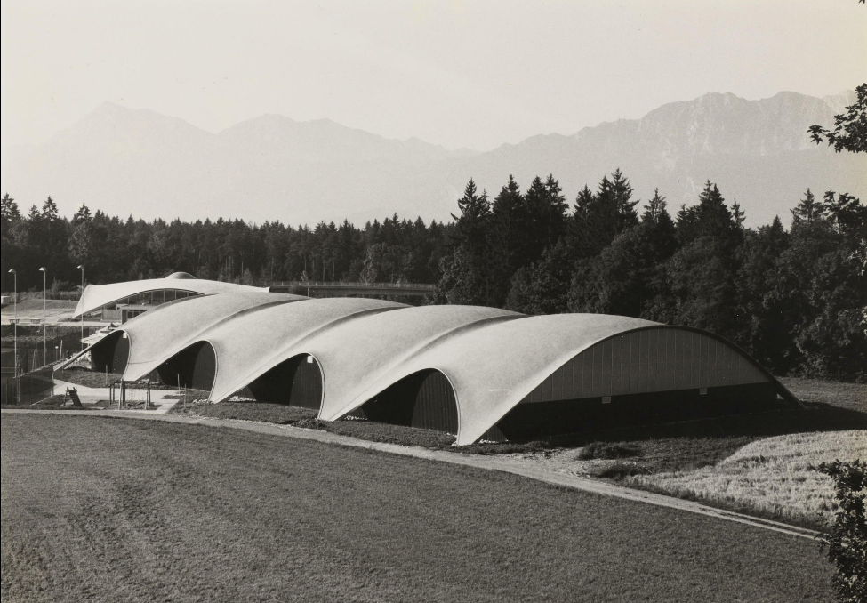
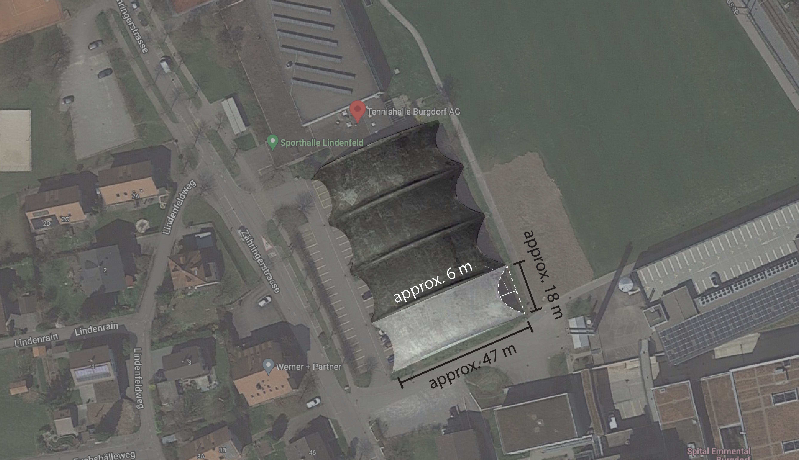

# Exercise


Complete the tasks below, and submit **by 9:00am on Friday, December 16th one zipped folder** that includes:

1. COMPAS .ui files for each task answer
2. and the PDF

Please follow the file naming convention as shown in the [**Syllabus**](../../syllabus.md#submissions).

#### \*\*\*\*[**Submit here**](https://polybox.ethz.ch/index.php/s/BA60XLsuQJdpWuj)


## Tasks

Complete the following three tasks. **A fourth task will be done during the work session**.


Use the Rhinoceros file named CSDI\_V\_exercise.3dm. Then, answer the questions in the docx file. You will find all these files **here**.


### 1. Modifying the force diagram

In the first task, you will design a shell with a square footprint which is a cross vault. Use one of the input methods we learned in the tutorial to input a topology which measures 15 m by 15 m overall, and is subdivided into 15 by 15 (a total of 225 quadrilaterals). [Follow the steps from the tutorial](\_tutorial-5.md#4-creases) to make your cross vault using either of the two methods. Save your RV3 session in this format : `V_1_a_jane-smith.ui`.

Now, `Clear scene`. Re-use your topology, but this time delete the central vertex by [following the steps in the tutorial](\_tutorial-5.md#6-holes) for modifying a pattern. Finish the formfinding process, then save your RV3 session in this format : `V_1_b_jane-smith.ui`.

### 2. Holes

Create a shell with an 8m by 8m footprint which is subdivided into 16 by 16 quadrilaterals. Using the same steps as in part b of task 1, remove the central vertex of your pattern and complete your formfinding. Look closely at your results and answer the questions in the `.docx` file for this task.

Next, using the same steps for modifying the pattern, create a hole which is near one of the corner supports. Answer the questions in the `.docx` file.

Now, for comparison, we are going to create the shell with a hole in the center using the **triangulation** input method. Draw the linework and give it to RV3. Again, answer the questions in the `.docx` file.


If you would like to make your own grids of lines, some helpful Rhino commands might be `Divide`, `ArrayLinear`, and `Split`.


### 3. Lip edges

For this task recreate one of the roof modules from the Heinz Isler Tennis Hall using RV3. The approximate dimensions are shown in Fig 3-3.

<figure><figcaption>
Fig 3-1 : Heinz Isler Heimberg Indoor Tennis Hall Source: https://darquitectura.tumblr.com/post/643438301203857408/heinz-isler-centro-de-tenis-y-piscina-cubierta-en
</figcaption></figure>

<figure><figcaption>
Fig 3-2 : Heinz Isler on Heimberg Shell Roof Source: https://www.ce.jhu.edu/perspectives/protected/html/lec15/pages/15-76%20Heinz%20Isler%20on%20Heimberg%20Shell%20Roof_150dpi.htm
</figcaption></figure>

<figure><figcaption>
Fig 3-3 : Site plan with dimensions
</figcaption></figure>


Sag is a percentage of the edge length.

