# Exercise


Complete the three tasks below, and submit **by 9:00am on Friday, December 16th one zipped folder** that includes:

1. COMPAS .ui files for each task answer
2. Rhino files with final shell mesh geometries
3. and the PDF

Please follow the file naming convention as shown in the [**Syllabus**](../../syllabus.md#submissions).

[**Submit here**](https://polybox.ethz.ch/index.php/s/VaipCVMQcJWcAgx)


## Tasks

Complete the following three tasks.

The goals of this exercise are:

1. that you practise the basic computational procedure for form finding with rV3, including generation of input topology, defining supports, calculate horizontal and vertical equilibrium and make modifications in the form\&force diagrams in order to add features.
2. that you use rV3 to understand how the internals forces flow within the shells. For example: what happens when you use different inputs topologies? or when you place openings in different parts of the shell? or when you add creases to the shell? how does the force flow changes? how do the reaction forces at the supports change?&#x20;


Use the Rhinoceros file named CSDI\_V\_exercise.3dm. Then, answer the questions in the docx file. You will find all these files [**here**](../#files).


### 1. Creases

In the first task, you will design a rectangular cross vault supported in its four corners. Follow one of the input methods that you learned in the tutorial to create a quadrilateral mesh topology that measures **15 m by 20 m** and make the necessary changes to get a topology that is appropriate for a cross vault. [Follow the steps from the tutorial](\_tutorial-5.md#4-creases) to make your cross vault using either of the two methods. Save your rV3 session in this format : `V_1_a_jane-smith.ui`.

After, make an opening at the center of the shell by reusing the same topology of your cross vault. Finish the formfinding process, then save your rV3 session in this format: `V_1_b_jane-smith.ui`. What differences in terms of force flow do you observe between the two shells?&#x20;


If you are using the `FromLines` input method and would like to make your own grids of lines, some helpful Rhino commands might be `Divide`, `ArrayLinear`, and `Split`. You can also create a mesh in Rhino and use `ExtractWireframe` to convert it to a grid of lines.


### 2. Holes

Form find two shells supported at the four corners, one with an opening in the center and the other with an opening close to the supports. The footprint of the shell should be **12m by 12m** and the topology should be subdivided into a **10 by 10** quadrilateral mesh. What differences in terms of force flow do you observe between the two shells?&#x20;

After, create a third shell with a hole in the center but this time using the **triangulation** input method. Draw the linework and perform the form-finding process. What differences do you observe between this third shell and the two previous ones?&#x20;

### 3. Design exploration

The final task is a free design task. We have three cinema halls with a freestanding, circular ticket and snack booth. We would like to build one or more shells to cover the space between the halls. There are a number of features we would like these shells to have, and a few constraints.

The shells can anchor anywhere on the <mark style="color:red;">**red**</mark> surfaces in the Rhino exercise file (some walls of the cinema halls and the entirety of the ticket and snack booth) or the ground. The <mark style="color:blue;">**blue**</mark> outline in Fig-1 indicates the approximate area that you should try to cover with your design, however you do not have to follow this one-to-one. 

<figure><figcaption>
Fig 1 : Site Plan for the Design
</figcaption></figure>

Each of these characteristics should be present in at least one of the shells : 
- [ ] Hole
- [ ] Dropdown
- [ ] Crease
- [ ] an edge which is fully supported
- [ ] two edges supported only at the corner


IMPORTANT: We recommend you start by making a hand sketch of the scheme for your shells. This will save you a lot of time.


When you finish formfinding a shell, save out your compas `.ui` file. Also save your final Rhino file with the meshes of your final shell(s). 

Answer the questions in the separate word doc titled `CSDI_V_exercise_task3.doc`. 

# Answers

Here are the answers to the RV3 Exercise. 


**The screenshots showing the form and force diagram color-coded is just meant to help you understand the answers. This was not required to be turned in.**


### 1. Creases

**A) Cross vault**
<figure>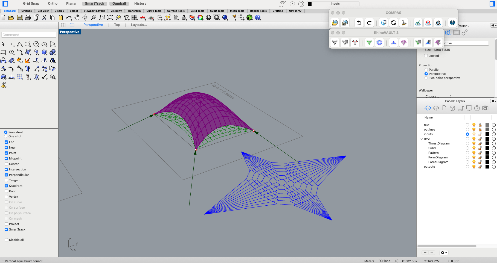<figcaption>
shell, form and force diagrams before modifying the force diagram
</figcaption></figure>

<figure>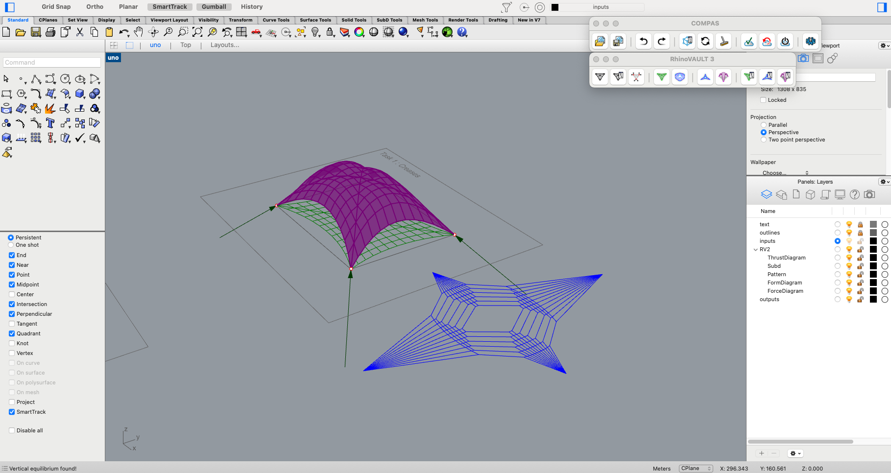<figcaption>
shell, form and force diagrams after modifying the force diagram
</figcaption></figure>

**B) Cross vault with central opening**

<figure><figcaption>
shell, form and force diagrams after modifying the force diagram
</figcaption></figure>

**C)** What is the difference in terms of force flow between a shell with supports at the four corners and a cross vault? (max 50 words).

The extra edges in the cross vault allow the forces to flow directly to the corners. The effect is like adding two arches which then provide more efficient paths for the forces to flow to the supports.

**D)** What differences in terms of force flow do you observe between the cross vaults from A) and B) ? (max 50 words).

When adding a hole at the intersection of the cross vaults, the forces are then directed around the edges of that hole and to the supports. It also interrupts the arches which are meant to provide more efficient paths to the supports, and therefore hinders the overall structural performance.

### 2. Holes

**A)**
<figure>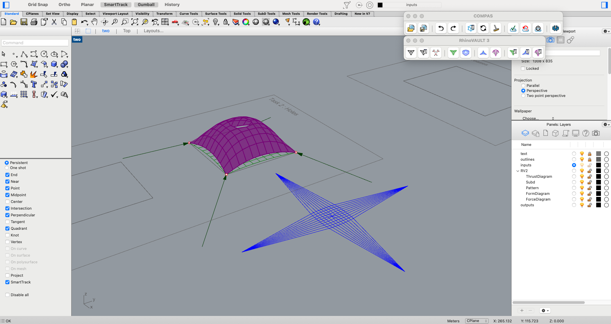<figcaption>
shell, form and force diagrams with the central hole (answer)
</figcaption></figure>

<figure>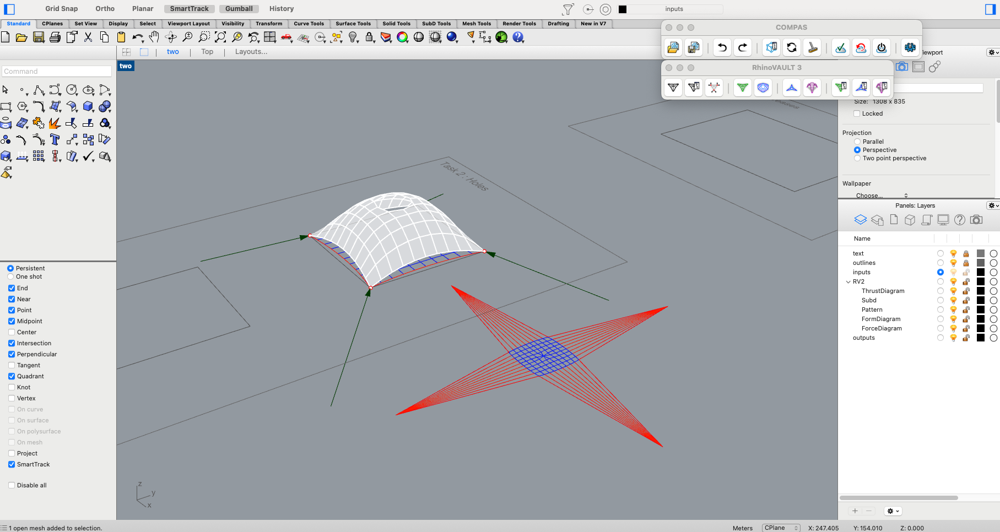<figcaption>
shell, form and force diagrams with the central hole (visualisation)
</figcaption></figure>

**B)**

<figure>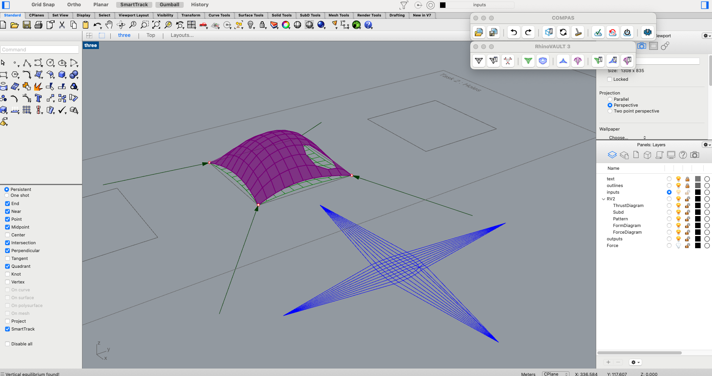<figcaption>
shell, form and force diagrams with the central hole near a support (answer)
</figcaption></figure>

<figure>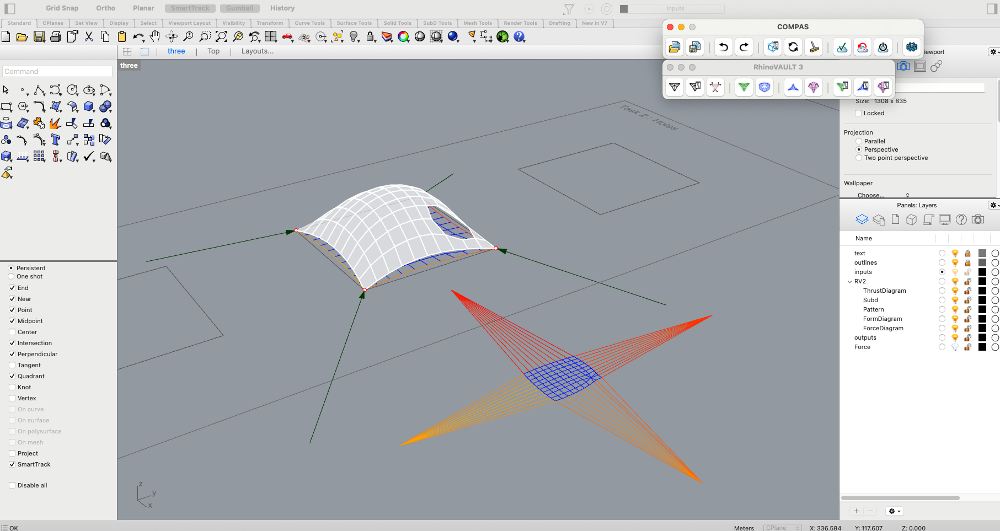<figcaption>
shell, form and force diagrams with the central hole near a support (visualisation)
</figcaption></figure>

**C)**

<figure>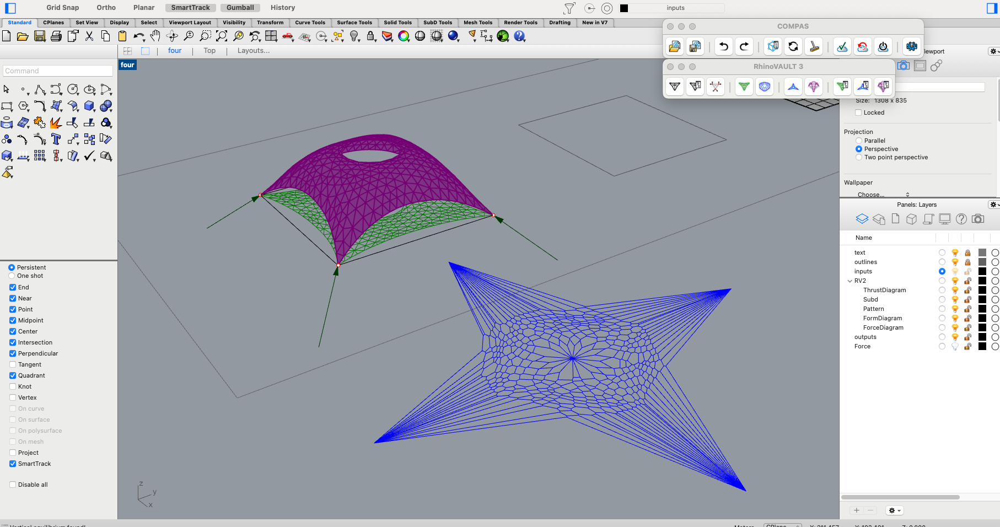<figcaption>
shell, form and force diagrams of the triangulated shell with the central hole (answer)
</figcaption></figure>

<figure>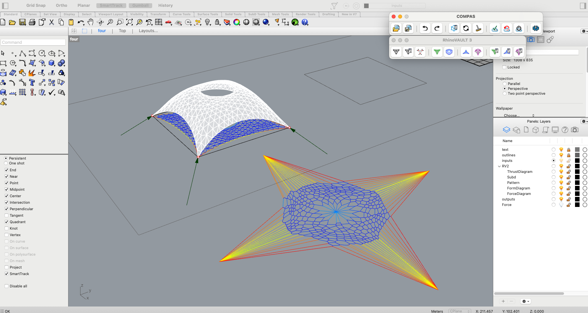<figcaption>
shell, form and force diagrams of the triangulated shell with the central hole (visualisation)
</figcaption></figure>

**D)** What differences in terms of force flow do you observe between the three cases? (max 50 words).

A central hole has even force distribution, while a hole near a support results in the shell loads concentrating in other edges. Triangulation means the forces do not have to flow to the edge and then down to the supports, meaning reactions are concentrated directly at the support corners. 

**E)** What are the advantages and disadvantages of creating a hole in your shell when using a quadmesh versus a triangulated mesh? (max 50 words).

Triangulation allows forces to flow around holes easily, and it efficiently redirects the forces to the supports. However, this results in an uneven force flow. Quadrilaterals are a more evenly distributed case where the edges are activated throughout. However, they are bidirectional therefore making it more difficult for the forces to flow around a hole.

### 3. Design exploration

Here is just one example of a valid solution to the third task. 

**A) Shell 1**
<figure>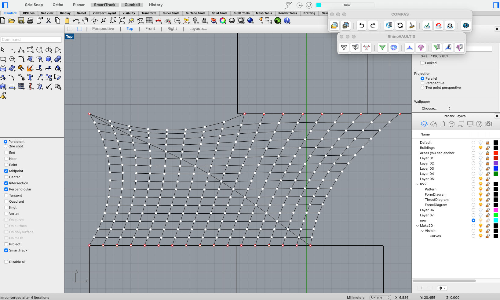<figcaption>
input topology/pattern of the shell (answer)
</figcaption></figure>

<figure>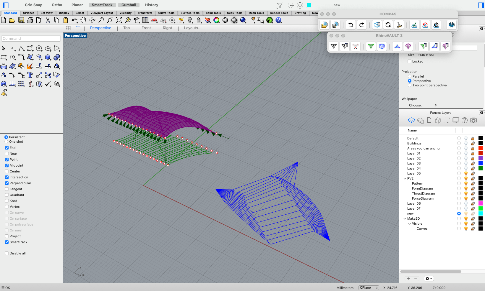<figcaption>
final shell, form and force diagrams (answer)
</figcaption></figure>

<figure>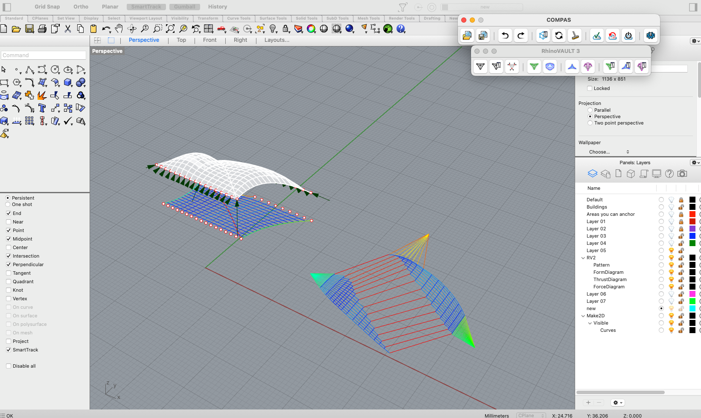<figcaption>
final shell, form and force diagrams (visualisation)
</figcaption></figure>

**B)**

**Shell 2**
<figure>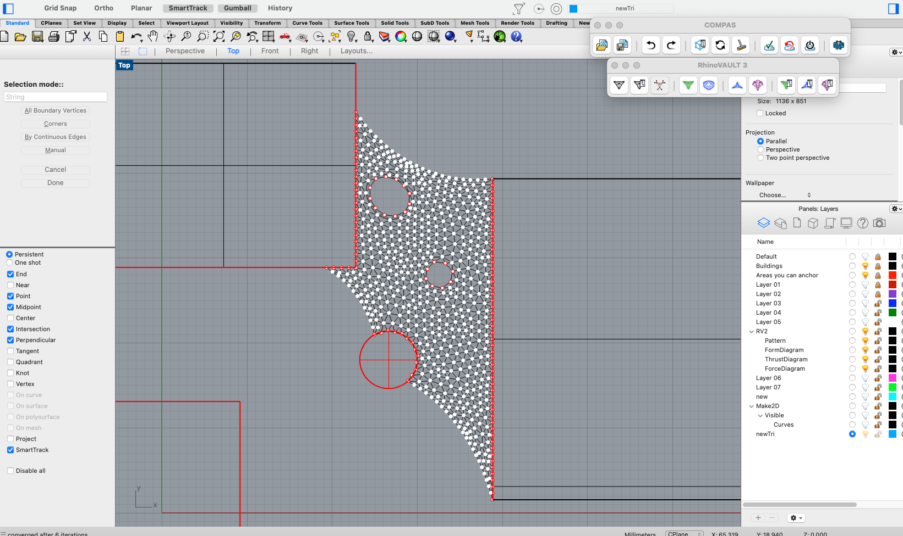<figcaption>
input topology/pattern of the shell (answer)
</figcaption></figure>

<figure>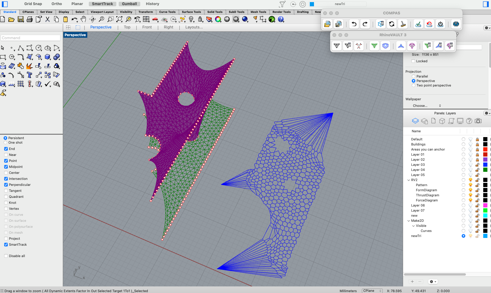<figcaption>
final shell, form and force diagrams (answer)
</figcaption></figure>

<figure>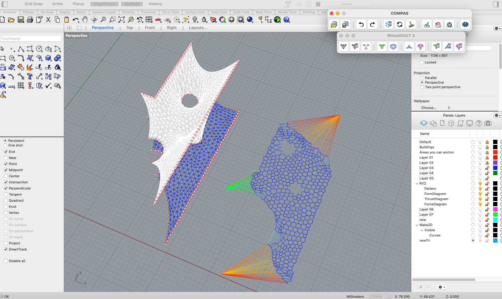<figcaption>
final shell, form and force diagrams (visualisation)
</figcaption></figure>

**Shell 3**
<figure>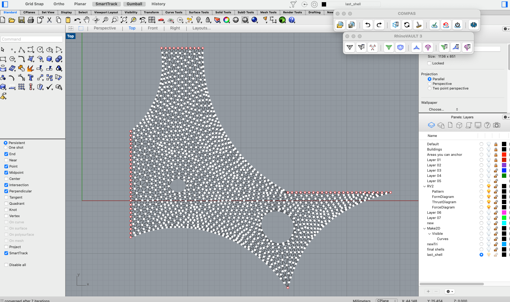<figcaption>
input topology/pattern of the shell (answer)
</figcaption></figure>

<figure>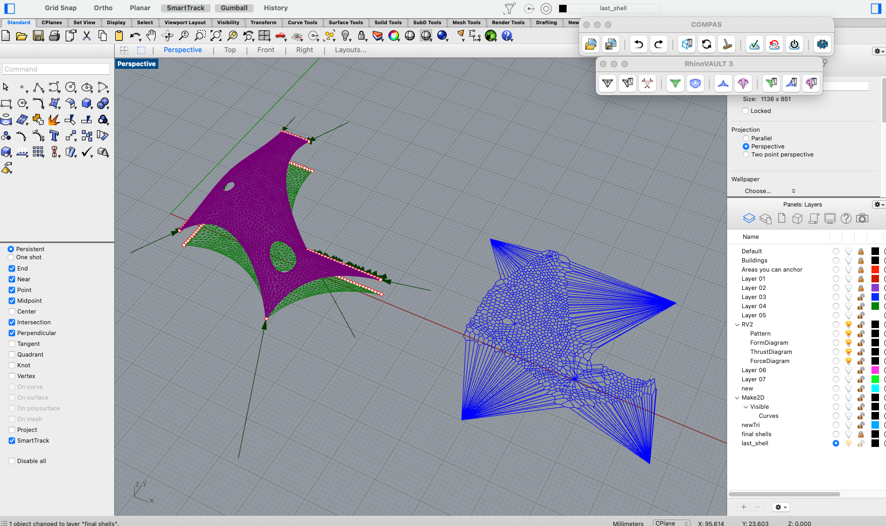<figcaption>
final shell, form and force diagrams (answer)
</figcaption></figure>

<figure>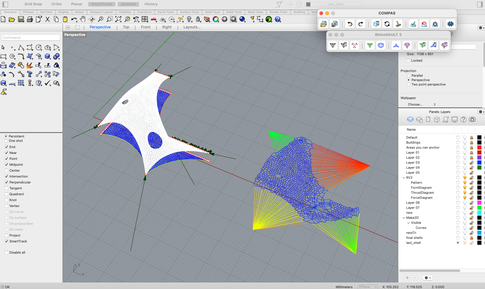<figcaption>
final shell, form and force diagrams (visualisation)
</figcaption></figure>

**C)** From an architectural perspective, what is your motivation in choosing this design? (max 50 words)

The intent was to create a series of shells which flow throughout the space, sometimes overlapping. Some more simple, some more complex. Some of them are also to be more arched and higher while others are flatter.

**D)** From a structural perspective, what is your motivation in choosing this design? (max 50 words)

Segmenting the space which needs to be covered helped control the resultant forces of the shells and make it smaller than if there was one large shell. Additionally, dropdowns and high percentages of slack were used to bridge larger distances or have more complex forms.
