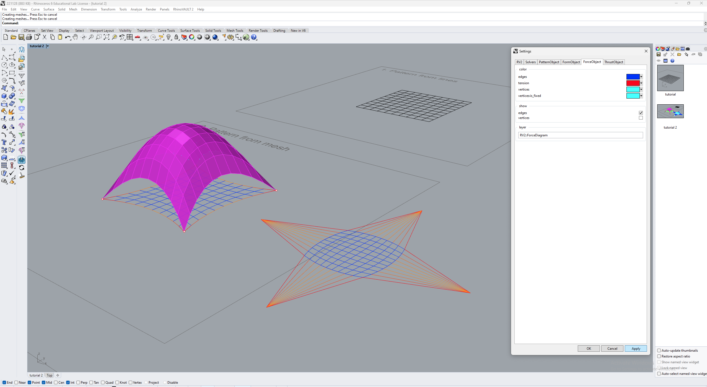
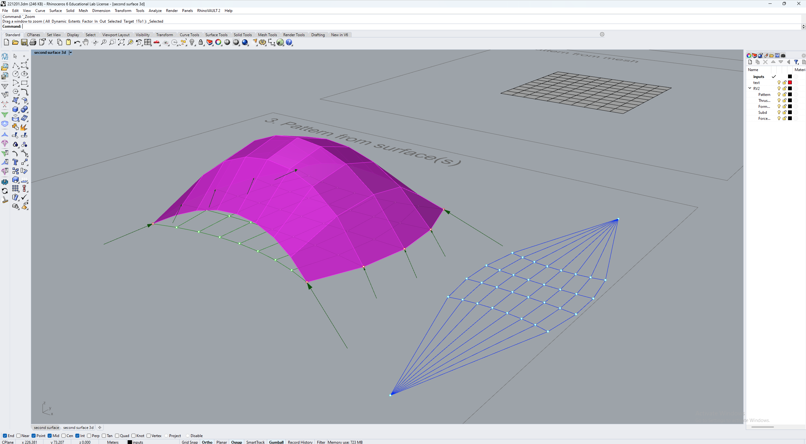
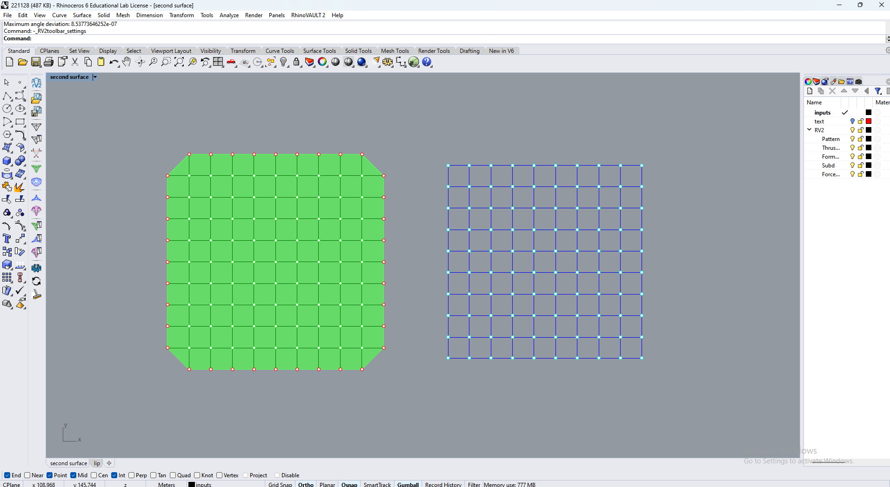

# Tutorial

## Learning goals

* form-find funicular shell structures using Rhino Vault 2
* explore different shell structures using the features of Rhino Vault 2

## Content

This tutorial will teach you the basic capabilities of RV2. As not all capabilities of the software will be included, feel free to browse [the documentation](https://blockresearchgroup.gitbook.io/rv2/quick-start/tutorial) on your own at a later time and try out the other more advanced tutorials.

The tutorial can be organised into these categories:

| Inputs | Features  | 
| --------- | - |
| 1 [Formfinding of a Shell from Lines](\_tutorial-5.md#1-formfinding-of-a-shell-from-lines)  | 4 [Creases](\_tutorial-5.md#4-creases--two-methods)  |
| 2 [Formfinding of a Shell from a Mesh](_tutorial-5.md#2-formfinding-of-a-shell-from-a-mesh)      | 5 [Lip Edges](_tutorial-5.md#5-lip-edges)  |
| 3 [Formfinding of a Shell from Surfaces](_tutorial-5.md#3-formfinding-of-a-shell-from-a-surface)          | 6 [Holes](_tutorial-5.md#6-holes)  |
|          | 7 [Dropdowns](_tutorial-5.md#80-dropdowns)  |

## Initialisation

As with IGS, the first step is to initiate the RV2 engine which imports all the relevant packages and activates `compas_cloud` server. This requires clicking the  icon or typing `_RV2_init`. The startup window also provides various links to useful information, such as the online documentation, tutorials, tutorials and terms of use. By clicking “YES,” you acknowledge that you have read and understood the Terms and Conditions, and the Data Donation Agreement.

<figure><figcaption>
Screen capture of the RV2 init window
</figcaption></figure>

## 1 Formfinding of a Shell from Lines

Let's start with the simplest workflow for using RV2, where we will make a simple shell supported at all its boundaries. In RV2, a **Pattern** is a collection of lines that define the topology of the form diagram. For this example we will use a simple grid of lines.

<figure><figcaption>
Initial grid of lines
</figcaption></figure>

### 1.1 Defining the Topology

Each line in the grid is a **segment**, meaning that these lines cannot run continuously from one side of the pattern to the other side and must instead be segmented into shorter lines per each quadrilateral in the pattern. The next step is to click the button  `Create pattern` and select the option `FromLines`. Next, select the lines of the pattern. It should then look like this.

<figure><figcaption>
Pattern
</figcaption></figure>

### 1.2 Identifying the Supports

The next step is to click the following series of commands: click the icon  to `Define boundary conditions`. Then in the Rhino command line, click on `IdentifySupports`, `Select`, then `AllBoundaryVertices`. Next **press enter twice** to exit out of the command and end the process of defining the boundary conditions. You can confirm that the program executed the command correctly when you see that all vertices located at the boundary of the pattern are displayed in <mark style="color:red;">**red**</mark>.

<figure><figcaption>
Support vertices
</figcaption></figure>

### 1.3 Creating the Form Diagram

Now that we have given RV2 the general topology of the shell and identified the supports, it is time to make the form diagram. This is done by clicking the button  `Create form diagram`. You should now see a green mesh which represents the shell. Currently this mesh is flat as we have not finished the process. This is also indicated by the fact that the mesh is <mark style="color:green;">**green**</mark> which means that the mesh is **not in equilibrium**.

<figure><figcaption>
Form Diagram
</figcaption></figure>

### 1.4 Creating the Force Diagram

The next step is to generate the force diagram. Unlike IGS, RV2 relies on an iterative solver and therefore the initial force diagram generated is actually the dual of the form diagram. We generate this diagram by clicking the button  `Create force diagram`. The diagram appears to the right of the form diagram.

<figure><figcaption>
Initial Force Diagram
</figcaption></figure>

While in IGS and our earlier work doing graphic statics by hand we have kept a parallel convention, RV2 does not use that convention. Instead, as presented in the lecture, RV2 uses a **perpendicular convention**. The red dots on the force diagrams with numbers therefore indicate the **angle deviation** of the force diagram, displaying the amount of degrees that those lines in the force diagram are off from being perpendicular to the corresponding edge in the form diagram.

In order to resolve this angle deviation, the next step is to find the horizontal equilibrium. This step initiates the iterative solver in RV2 which will change the force diagram from being the dual into the force diagram to find the **compression-only equilibrium** for the shell structure on the horizontal plane.

To do this, we click the button  `Horizontal equilibrium`. The command line then has three options : `Alpha`, `Iterations`, and `RefreshRate`. In this tutorial we will not change these options, however it is good to know that `Iterations` dictates how many times the solver for the horizontal equilibrium will run. This helps prevent crashing your computer should you try to find the equilbrium of a form and force diagram which cannot be in equilbrium, but also means that more complex diagrams require either running the `Horizontal equilibrium` command multiple times or increasing the number for `Iterations`.

The solver will run and adjust the force diagram, which in this example is quite simple. The numbers on the force diagram will disappear, and the command line will display the words "Horizontal equilibrium found!".

<figure><figcaption>
Force Diagram in Horizontal Equilibrium
</figcaption></figure>

### 1.5 Generating the Thrust Object

Next, we will click the button  `Vertical equilibrium` to find the vertical equilibrium of the shell structure and generate the thrust object (the mesh which represents the shell). RV2 will automatically calculate a height that is ideal for the shell structure based on self weight, however it is also possible to click on `TargetHeight` and change the value.

<figure><figcaption>
Vertical Equilibrium
</figcaption></figure>

After running this step, you can see that the mesh has changed from <mark style="color:green;">**green**</mark> to **pink**. Whenever you are going through the workflow in RV2, keep this in mind at all times. If changes are made in the form or force diagrams, or to the thrust object itself, the equilibrium must be recalculated.

### 1.6 Saving the RV2 Results

Unlike IGS, there can only be one RV2 session running in Rhino at a time. Therefore, in order to keep your results and be able to continue your formfinding at a later time, you need to save out your RV2 files **.rv2** scene files. This can be easily done by clicking  `Save RV2 session`. Similarly to grasshopper you can later open your base Rhino file, initialise RV2, and load these .rv2 scene files in order to recover your results by clicking  `Open RV2 session`.

It is worth noting that you can save your rhino file from RV2 and still recover your final results, however without saving the RV2 session as a .rv2 file you will no longer be able to work on the shell and continue your formfinding.

### 1.7 Clearing the Scene

In order to move on to the next example, we have to clear out our RV2 session in order to start from scratch. You can easily do this by clicking  `Clear scene`.

## 2 Formfinding of a Shell from a Mesh

Before starting this example, it is important to know the difference between a mesh and a surface.

* Rhino defines a [surface](http://docs.mcneel.com/rhino/5/help/en-us/seealso/sak\_surface.htm) as being like a rectangular stretchy rubber sheet. The NURBS form can represent simple shapes, such as planes and cylinders, as well as free-form, sculptured surfaces.
* Rhino defines a [mesh](http://docs.mcneel.com/rhino/5/help/en-us/commands/mesh.htm) as a collection of vertices and polygons that define the shape of an polyhedral object.

In summary, **meshes** are composed of faces, edges, and vertices while **surfaces** are best described as the pure mathematical expression of the geometry.

Now that we know the difference, we can begin the example. Here we will expand upon the simple workflow to make a simple shell supported at its four corner points. We will also go through different options for visualisation in RV2.

### 2.1 Defining the Topology

We begin with a simple mesh with the same dimensions and subdivisions as our last example, as shown in Fig 2-1.

<figure><figcaption>
Fig 2-1 : Initial Mesh
</figcaption></figure>

First, we select  `Create pattern` and select the option `FromMesh`. Next, select the mesh. It should then look like this.

<figure><figcaption>
Fig 2-2 : Pattern from Mesh
</figcaption></figure>

### 2.2 Identifying the Supports

The next step is to click the following series of commands: click the icon  to `Define boundary conditions`. Then in the Rhino command line, click on `IdentifySupports`, `Select`, then `Corners`. Press enter to allow RV2 to find and select the corners.

<figure><figcaption>
Fig 2-3 : Supports Located at the Corners
</figcaption></figure>

At this point it is important to note that as a consequence of selecting only the four corners, we must now update our form diagram to accomodate for this choice. In order to understand how we must update our form diagram, we can isolate one vertex and graphically calculate the equilibrium of that node by drawing the force diagram (Fig 2-4 left). In the case on the left (straight boundaries), since the directions of the forces along the opening needs to be horizontal, you can not close the force polygon unless the force perpendicular to the opening is zero. However by updating the form diagram with a sag equal to 10% of the span of the opening, the force polygon can be closed using forces with finite magnitude (Fig 2-4 right).

<figure><figcaption>
Fig 2-4 : Pattern with no sag (left) and pattern with 10% sag at the openings (right)
</figcaption></figure>

This sag feature is available in RV2. In the Rhino command line, click on `UpdateBoundaries`. You will now see that each side of the pattern has received an identification number as in Fig 2-4.

<figure><figcaption>
Fig 2-5 : Pattern with sides identified
</figcaption></figure>

We can now change the amount of sag on individual boundaries, or one by one. We will go ahead and add a sag of 10% to all boundaries. Do this by clicking `All`, and then `Sag10`. We can see the sag that is applied to the sides in Fig 2-5. Now **press enter twice** to apply all the changes to the topology.

<figure><figcaption>
Fig 2-6 : 10% Sag applied to sides
</figcaption></figure>

### 2.3 Creating the Form Diagram

Next we will create the form diagram as before by clicking  `Create form diagram`.

<figure><figcaption>
Fig 2-7 : Form Diagram
</figcaption></figure>

### 2.4 Creating the Force Diagram

Now click  `Create force diagram`. In this example we can see many more dots indicating angle deviations, shown in Fig 2-7. This is resolved in the horizontal equilibrium step. To do this, we click the button  `Horizontal equilibrium`. If you run the solver once and there are remaining angle deviations, just run the `Horizontal equilbrium` command again. The final force diagram after solving for equilibrium is shown in Fig 2-8.

<figure><figcaption>
Fig 2-8 : Force Diagram not in Equilbrium
</figcaption></figure>

<figure><figcaption>
Fig 2-9 : Final Force Diagram in Equilibrium
</figcaption></figure>

### 2.5 Generating the Thrust Object

Next, we will click  `Vertical equilibrium` to find the vertical equilibrium of the shell structure and generate the thrust object.

<figure><figcaption>
Fig 2-10 : Initial Thrust Object
</figcaption></figure>

In this instance, let's change the height of the shell to see what happens. Click on  `Vertical equilibrium` again, and this time click on `TargetHeight` to edit the value. Type **2** and then hit enter **twice**. Now we can see a shallow shell with increasted reaction forces at the corners.

<figure><figcaption>
Fig 2-11 : Thrust Object with 2m Height
</figcaption></figure>

Next, let's increase the height to see the effect this has on the reaction forces. Click on  `Vertical equilibrium` again, and change the `TargetHeight` value to **6**.

<figure><figcaption>
Fig 2-12 : Thrust Object with 6m Height
</figcaption></figure>

We can see that this taller shell has decreased reaction forces at its corners in comparison to the shallow shell, as we would expect. While this visualisation is helpful, there are actually many other visualisation options in RV2 to help us more easily comprehend the force flow in the shell.

### 2.5 Visualisation Options

While we will not go over all the settings, we will go through a number of them which might be helpful for your. Click on  `Settings`. In the `RV2` tab, we can see the `angle tolerance` which determines the minimum value before RV2 displays the red dot with the angle deviation in the force diagram. The `forces` option color codes your form to your force diagram, allowing you to easily see which edges are taking the greatest forces. In Fig 2-13 the `forces` are shown.

<figure><figcaption>
Fig 2-13 : RV2 Settings
</figcaption></figure>

In the `FormObject` Tab we can show and hide the `edges` and the `vertices` of the form diagram. In Fig 2-14 the `edges` remain shown but the `vertices` have been hidden.

<figure><figcaption>
Fig 2-14 : FormObject Settings
</figcaption></figure>

In the `ForceObject` Tab we find the same types of settings, but now for the force diagram. In Fig 2-15 the `vertices` have been hidden and the `edges` are still shown.

<figure><figcaption>
Fig 2-15 : FormObject Settings
</figcaption></figure>

The final tab `ThrustObject` has numerous helpful visualisation settings. Similar to our grasshopper exercises from before, we can do things such as show pipes. We are also able to display the stresses throughout the shell, color coding our form to our force diagram and increasing the speed with which we can analyse our results. Feel free to play around with these settings. In Fig 2-16, the `pipes` and `stresses` are shown.

<figure><figcaption>
Fig 2-16 : FormObject Settings
</figcaption></figure>

## 3 Formfinding of a Shell from a Surface

In order to use a surface, it must first be subdivided into a mesh object. In this example we will use **quadrilateral meshes** as they easier for RV2 to use, while there are also advantages and disadvantages to using this type of method versus **triangulation** (Example 4.0).

### 3.1 Surface Subdivision

First we will input a surface with a number of curves to it.

<figure><figcaption>
Fig 3-1 : Input Surface
</figcaption></figure>

Click  `Create pattern` and select the option `FromSurfaces`. RV2 will show you a grey linework representing a standard quadrilateral subdivision of the mesh (Fig 3-1), from which we will make adjustments.

<figure><figcaption>
Fig 3-2 : Simple Subdivision
</figcaption></figure>

We can now explore the different subdivision options. Click `SubdivideEntireMesh` and enter **8**. Now we can see the grey subdivision become much denser (Fig 3-3).

<figure><figcaption>
Fig 3-3 : Densified Subdivision
</figcaption></figure>

We can customise the subdivision further by selecting `SubdivideEdgeStrip` and clicking on the **black line** which represents the left edge of the surface. Type **4** and press enter. Now, we can see that RV2 has changed the subdivision in the direction of that edge to 4, and left the subdivision in the opposite direction unchanged.

<figure><figcaption>
Fig 3-4 : Edge Strip Subdivision
</figcaption></figure>

Hit enter until you see the final pattern. Then, click `Define boundary conditions`, and identify the vertices at the left and right edges as the supports (see Fig 3-5).

<figure><figcaption>
Fig 3-5 : Side Vertices as Supports
</figcaption></figure>

*  `Create form diagram`
*  `Create force diagram`
*  `Horizontal equilibrium`
*  `Vertical equilibrium`

If you have forgotten any of the steps, feel free to scroll through the rest of the tutorial. Your results should look something like this:

<figure><figcaption>
Fig 3-6 : Shell from Subdivided Surface
</figcaption></figure>

### 3.2 Triangulation

We have seen the quadrilateral mesh subdivision of surfaces, and will now explore a different method of subdivision : **triangulation**.

<figure><figcaption>
Fig 3-7 : Input Lines
</figcaption></figure>

We begin with a series of lines to guide our triangulation. First, we select  `Create pattern` and select the option `FromTriangulation`. Next, select the outer outline as the **outer boundary** and press enter. Select the circle as the **inner boundary** and press enter.

An optional input of the triangulation process is to provide a constraint curve. This curve guides the triangulation subdivision such that the vertices and edges of the triangulation are aligned to this curve in order to include it in the topological generation.

The final step is to **Specify target edge length** which determines how large the triangles are. We will leave this value as **1** and press enter to finish the triangulation process.

<figure><figcaption>
Fig 3-8 : Triangulation
</figcaption></figure>

Define all the boundary vertices as supports and create the form and force diagrams. Find the horizontal equilibrium, and analyse the results. The shell should look like Fig 3-9.

<figure><figcaption>
Fig 3-9 : Shell from Triangulation
</figcaption></figure>

## 4 Creases : Two Methods

We will now look at methods of interacting with the **force diagram** to affect our formfinding.

### 4.1 Method One : Moving Vertices in the Force Diagram

The first method for adding creases to our shell is to move vertices in the force diagram and recalculate the equilibrium.

Start by clicking  `Create pattern` and select the option `FromSurfaces`. Click on our surface. Click `SubdivideEdgeStrip`, select the left edge, and increase the subdivision to **8**. The result should look like Fig 4-1.

<figure><figcaption>
Fig 4-1 : Pattern for Crease
</figcaption></figure>

Next, define all the boundary vertices as supports. It should look like Fig 4-2.

<figure><figcaption>
Fig 4-2 : Boundary Supports Defined
</figcaption></figure>

We will now find the initial shell without the crease applied. Generate the form and force diagrams, and then find the horizontal equilibrium. Then, find the vertical equilibrium. Your result should look like Fig 4-3.

<figure><figcaption>
Fig 4-3 : Initial Shell Before Crease
</figcaption></figure>

#### 4.1.1 Modify the Force Diagram

We will now modify the force diagram to apply our creases. The first step is to click  `Modify Force Diagram`. Then in the Rhino command line, click on `MoveVertices`. Select `Manual` and draw a box around a number of points from the force diagram and hit enter. Then, click on one of the points, and then click again to finalise the movement. See Fig 4-4 to see the steps.

<figure><figcaption>
Fig 4-4 : Steps for Modifying the Force Diagram
</figcaption></figure>

The final force diagram should look something like this :

<figure><figcaption>
Fig 4-5 : Force Diagram Post-Modifications
</figcaption></figure>

Now, we need to recalculate the horizontal equilibrium. Click the button  `Horizontal equilibrium`. Then click  `Vertical equilibrium` to also recalculate the vertical equilibrium. We now have our shell with two creases in it!

<figure><figcaption>
Fig 4-6 : Shell with Two Creases
</figcaption></figure>

### 4.2 Method Two : Setting Force Minimums and Maximums in the Force Diagram

The second method for adding creases is to define the forces in particular edges of the force diagram. For this example, let's make a cross vault. A cross vault can be seen as having two creases which run between supports at the corners which are diagonal from each other, which we can also visualise as being arches within our shell which start and end at these supports.

Taking our simplest grid of lines, let's adjust this in order to be the topology required for our cross vault. Currently, there is no way for an arch within our topology to connect the corners diagonally. This indicates that we need to add edges.

Type `Line` and draw a line that goes from the upper left corner of the pattern to the bottom right corner. Select your line and type `Mirror`, then click on a point in the middle of the pattern, hold shift and move your cursor up or down. When you see the correct diagonal mirrored in the viewport, press enter.

Now, we know that this line needs to be in **segments** for the topology to work. Type `Split` and select both your lines. Then Drag a box to add the other lines in the original pattern which will split our line geometries (see Fig). Press enter. Your line should now be split into ten segments.

<figure><figcaption>
Fig 4-7 : Adding Line Edges
</figcaption></figure>

<figure><figcaption>
Fig 4-8 : Final Pattern
</figcaption></figure>

Next, go through all the basic steps to create your base thrust object with supports at the corner points and a `TargetHeight` of **6**. Here are the buttons you will need to click :

*  `Create pattern`, `FromLines`
*  to `Define boundary conditions`,
  * `IdentifySupports`, `Select`, `Corners`
  * `UpdateBoundaries`, `All`, `Sag10`
*  `Create form diagram`
*  `Create force diagram`
*  `Horizontal equilibrium`
*  `Vertical equilibrium`

If you have forgotten any of the steps, feel free to scroll through the rest of the tutorial. Your results should look something like this:

<figure><figcaption>
Fig 4-9 : Unaltered Shell
</figcaption></figure>

Now, let's modify our force diagram. Click  `Modify Force Diagram`. Next, click `EdgesAttributes` and then `Manual`. Hit enter and the settings box will appear. Click on `lmin` and change the value to **5**. Click Ok.

<figure><figcaption>
Fig 4-10 : Changing Force Edge lmin
</figcaption></figure>

Now we need to recalculate our horizontal equilibrium. Click  `Horizontal equilibrium`, and your results should look like Fig-11:

<figure><figcaption>
Fig 4-11 : Changing Force Edge lmin
</figcaption></figure>

We see that the forces in the edges we selected have greatly increased, and as a result the forces in the opposite crease have also begun to take more forces. The mesh for our thrust object is <mark style="color:green;">**green**</mark>, indicating that it **needs to be updated**. So click on  `Vertical equilibrium` to see our results.

<figure><figcaption>
Fig 4-12 : Updated Thrust Object with Creases
</figcaption></figure>

Now we can see the creases in our shell, with one exaggerated and the other somewhat more shallow. Feel free to go back throught the stops to make the other crease as exaggerated as the other, or explore different options.

## 5 Lip Edges

We will now take a look at how to manipulate the force diagram in order to achieve a lip at the edge of the shell. A nice example of this effect is Heinz Isler's Wyss Garten Haus, shown in Fig 5-1.

<figure><figcaption>
Fig 5-1 : Close-up Photograph of Heinz Isler's Wyss Garten Haus Source: https://schoenstebauten.heimatschutz.ch/de/moderne-architektur-im-kanton-solothurn-1940-bis-1980
</figcaption></figure>

In order to make this change in the shell, we must **redirect** where our greatest forces will flow. Typically, in or shell formfinding (such as in Example 2.0) the greatest forces have been in the outermost edge of our shell, flowing down to the support points at the corners. In this case, we would like to have these greatest flowing through some edge that is not at the very outside of our shell.

Generate the topology by creating the pattern from our grid of lines. Next, identify the supports as the vertices along the top and bottom edges of our pattern.Your result should look like Fig 5-2.

<figure><figcaption>
Fig 5-2 : Edges with Support Vertices Selected
</figcaption></figure>

Next, click `UpdateBoundaries` and apply a sag of 10% to all boundaries.

<figure><figcaption>
Fig 5-3 : Opposite Edges with Sag 10% Applied
</figcaption></figure>

Next create the form and force diagram, and calculate the horizontal equilibrium. You should now see the same thing as in Fig 5-4.

<figure><figcaption>
Fig 5-4 : Form and Force Diagrams Generated, with Horizontal Equilibrium Found
</figcaption></figure>

### 5.1 Initial Shell without Modification

Before we change the force digram, we will generate our shell **with a Target Height equal to 6** to see the existing concentrations of forces.

<figure><figcaption>
Fig 5-5 : Initial Shell
</figcaption></figure>

Using our new insight on the RV2 settings, let's visualise the forces in the shell to more easily see the forces in the form diagram.

<figure><figcaption>
Fig 5-6 : Color Coded Form and Force Diagrams
</figcaption></figure>

Now we can clearly see that the longest edges in the force diagram, therefore the largest forces overall, are in the outer edges of the shell. One straightforward way to modify those large forces to be in an inner edge is to **limit the amount of forces permitted in the outermost edges**.

### 5.2 Modifying the Force Diagram

The first step is to click  `Modify Force Diagram`. Next, click `EdgesAttributes` and then `Manual`. Select the edges of the force diagram which are <mark style="color:red;">**red**</mark>, and press enter.

Click on the value for `lmax` and replace the old value with **1.5**. Press enter, then click `OK`. Your screen should look like this:

<figure><figcaption>
Fig 5-7 : Thrust Object after Modifying Force Diagram
</figcaption></figure>

You might have noticed that nothing really changed, except the color of the thrust object. It is important to note that the thrust object has now turned <mark style="color:green;">**green**</mark>, indicating that it **needs to be updated**.

### 5.3 Update the Force Diagram and Thrust Object

The first step is to again find the horizontal equilibrium, so click  `Horizontal equilibrium`. It should look like Fig 5-7:

<figure><figcaption>
Fig 5-8 : Updated Force Diagram
</figcaption></figure>

We see now that the edges of the force diagram we constrained to have an `lmax` of **1.5** have shrunken significantly and are now green, indicating they are taking less forces. We see now that as a result, the lines for the edge which lies behind the outer edge are now red and taking most of the forces. Let's generate our thrust object to see the effect in 3D by clicking  `Vertical equilibrium`.

<figure><figcaption>
Fig 5-9 : Updated Thrust Object Perspective
</figcaption></figure>

<figure><figcaption>
Fig 5-10 : Updated Thrust Object Front View
</figcaption></figure>

We can see the lip which is now a part of the shell form happening over the openings. With more modification, we could turn this into a more dramatic effect by moving the lip more inwards or modifying the force diagram in other ways.

## 6 Holes

Now that we can formfind shells really well, let's go over how to make a hole in one. Of course, as you have seen already, you can have a hole in your pattern, however it is also possible to add holes after you have formfound a shell in equilibrium.

### 6.1 Initial Shell

You have been giving a simple square surface. Make your pattern and subdivide the entire mesh by **10**. It should look like this :

<figure><figcaption>
Fig 6-1 : Pattern
</figcaption></figure>

Next, define the supports as all the boundary vertices, create the form and force diagrams, and find the horizontal equilibrium.

<figure><figcaption>
Fig 6-2 : Final Form and Force Diagrams
</figcaption></figure>

Now create the thrust object:

<figure><figcaption>
Fig 6-3 : Initial Thrust Object
</figcaption></figure>

In order to compare our results, make a new layer in rhino named **Initial Shell**. Make a copy of the thrust object and place it on this layer. Hide the layer, and `Clear Scene`.

### 6.2 Modifying the Topology

Now that we have our shell in compression we can begin the process of adding a hole to it. Type `Show` in order to show our initial surface again. Then, as before, subdivide it by **10** and press enter. Next, click  `Modify Pattern`. Click `DeleteVertices` and choose a vertex near one of the corner supports. Press enter. Your pattern should now look similar to Fig 6-4:

<figure><figcaption>
Fig 6-4 : Pattern after Deleting Vertex
</figcaption></figure>

Now as before, define the supports as the boundary vertices. Make sure you do not accidentally include the vertices of the hole we have created. If you do, you can make use of the `Unselect` function in the `Define boundary conditions` process. Apply a sag to the edges of the new opening, then create the form and force diagrams and the horizontal and vertical equilibrium:

<figure><figcaption>
Fig 6-5 : Selection of Faces
</figcaption></figure>

You can see how the shell is trying to accommodate for the hole we have made, and in order to do a better comparison you can unhide the initial thrust object on our other layer and change the color of the mesh to distinguish them from one another. This allows you to see the changes throughout the entirety of the shell which happen in order to redirect the forces around the hole while remaining in compression.

<figure><figcaption>
Fig 6-6 : Comparison of the Two Shells
</figcaption></figure>

## 8.0 Dropdowns

Do not clear your scene for this example! We will now take the hole we created in our shell structure and turn it into a dropdown.

### 8.1 Modify Thrust Diagram Vertices

Begin by clicking on  `Modify Thrust Diagram` again. This time, select `VerticesAttributes` and then `Manual`. Select all the vertices which outline the hole in your shell, then press enter. As before, a box will pop up with the settings options for these vertices.

<figure><figcaption>
Fig 8-1 : Selected Vertices
</figcaption></figure>

<figure><figcaption>
Fig 8-2 : Selected Vertices Settings
</figcaption></figure>

Click on the value `is_anchor` and modify it to **True**. Click `OK`. The vertices you selected should now turn <mark style="color:red;">**red**</mark>. At this point, it is now as if there are support points for the shell around our void located at those x,y,z coordinates. So, we would like to take those points and move them to the ground.

Click  `Modify Thrust Diagram` and this time select `MoveSupports`. Select the points you want to move. As the points are at different heights, you may also want to move one point at a time to align with the ground. Repeat these steps until all your new support points are at ground level. The result should look something like this :

<figure><figcaption>
Fig 8-3 : New Supports Moved to Ground Plane
</figcaption></figure>


In Rhino, if you would like to run your last command again you can press the **spacebar.**


Now that we have changed the supports, we need to also recalculate our horizontal equilibrium. Click the button  `Horizontal equilibrium`.

<figure><figcaption>
Fig 8-4 : Updated Horizontal Equilibrium
</figcaption></figure>

Next recalculate the vertical equilibrium. Click the button  `Vertical equilibrium`.

<figure><figcaption>
Fig 8-4 : Updated Vertical Equilibrium
</figcaption></figure>

Now we can see that the shell has been smoothed out to accommodate for the void we made in it as well as the new supports we specified.

## This marks the end of the tutorial!

You now know all of the basic steps to use RV2 for finding shells in a compression-only equilibrium.
