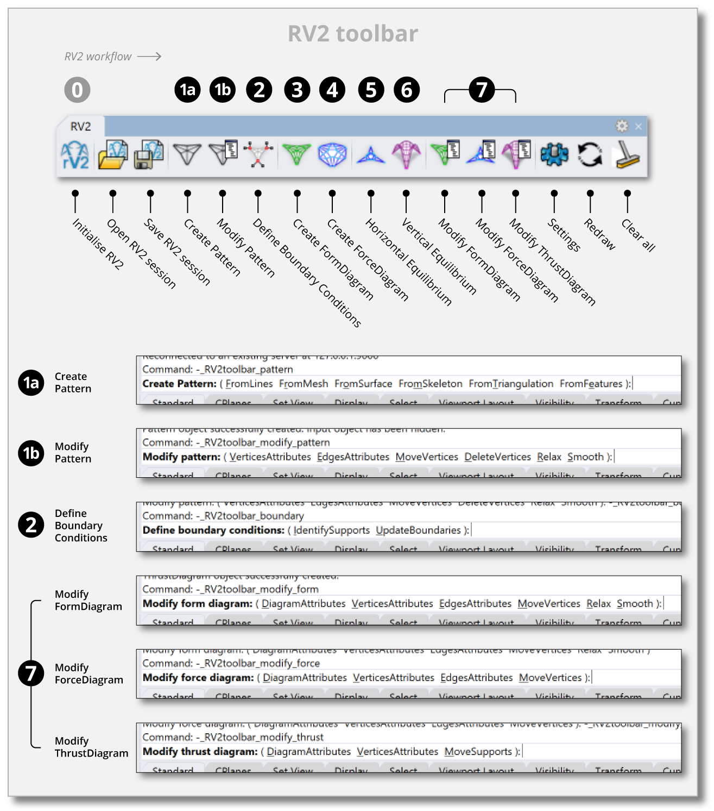

# RV2 workflow & UI

The first tutorial session, in the RV2 gitbook, (link below) provides an overview of the RV2 workflow, and the user interface, highlighting and describing the main features of RV2. Detailed options and parameters will be addressed more in-depth in later tutorials.

**What is covered in this tutorial session:**
- Organization and structure of the RV2 workflow; sequence of procedures and solvers
- Overview of the RV2 user interface: the menu and the toolbar
  
Link to the RV2 gitbook: [https://app.gitbook.com/@blockresearchgroup/s/rv2/quick-start/workflow](https://app.gitbook.com/@blockresearchgroup/s/rv2/quick-start/workflow)

<figure><figcaption>
RV2 Toolbar
</figcaption></figure>